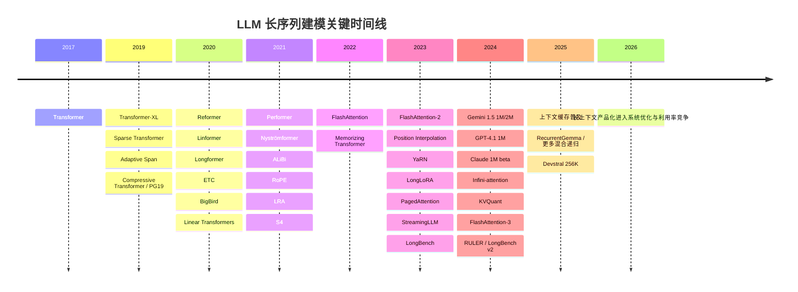
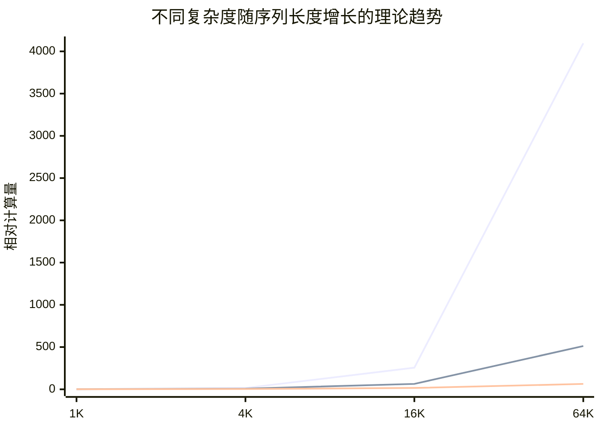

# LLM 长序列建模与长文本能力发展综述

## 执行摘要

长序列能力的主线并不是单纯“把上下文窗口做大”，而是**算法降复杂度、位置外推、记忆与检索、系统级缓存和并行**的协同演进。学术界从稠密注意力走向稀疏、线性、递归与状态空间；工业界则逐步形成共识：**大窗口很重要，但仍需要 RAG、重排、缓存、分块与严格评测**。到二零二六年，一百万级上下文已产品化，但多跳推理、上下文利用率和成本仍是核心瓶颈。

## 脉络总览

如果把“长文本能力”拆开看，实际上有四条互相交织的技术线：其一是**注意力本身的复杂度改造**，从全注意力到稀疏、局部-全局、LSH、低秩、核方法与线性化；其二是**位置与长度泛化**，从相对位置、RoPE、ALiBi 到 PI、YaRN 等上下文扩展方法；其三是**外部或压缩记忆**，包括 recurrence、compressive memory、KV cache、streaming 与检索增强；其四是**系统工程**，包括 FlashAttention、PagedAttention、activation checkpointing、context/sequence parallelism、offload 与稀疏 kernel。学术论文回答“能否更长、更准、更省”，而工业实践回答“能否以可控成本稳定上线”。

下图概括了关键节点。为避免把“算法创新”和“产品窗口大小”混为一谈，图中同时展示学术与产业的代表性里程碑。

下面这张图不是实测 benchmark，而是按论文给出的**理论复杂度**画出的增长趋势。它解释了为什么序列长度一旦从几千扩到数十万，系统瓶颈会迅速从 FLOPs 转到**显存、HBM 读写与 KV 缓存**。

为了方便工程选型，先给出一张总表。表里的**复杂度与记忆占用**是典型实现下的渐近量级；“长序列性能”“实现难度”“成熟度”是结合 LRA、LongBench、RULER、NIAH 类测试与公开工程生态做的归纳性判断，而非单一论文原文指标。

| 方法家族 | 代表工作 | 训练/预填充复杂度 | 主要显存压力 | 长序列性能 | 实现难度 | 成熟度 | 适用场景 |
|---|---|---:|---:|---|---|---|---|
| 全注意力 | Transformer | O(n²) | 注意力矩阵与激活高 | 短中程最稳，超长成本极高 | 低 | 极高 | 通用预训练、短中上下文 |
| 稀疏/局部-全局 | Longformer / ETC / BigBird / SWA | O(n·w) 或近线性 | 随窗口线性增长 | 文档、摘要、结构化长文较强；全局多跳依赖受 mask 设计影响 | 中 | 高 | 文档 QA、摘要、开源部署 |
| LSH / 分桶 | Reformer | O(n log n) | 比全注意力低 | 理论省，但调参与 kernel 实现复杂 | 高 | 中 | 研究型尝试、特殊长序列 |
| 低秩 / 线性 / 核方法 | Linformer / Linear Transformer / Performer / Nyströmformer | O(n) 到 O(nk) | 近线性 | 中长序列表现可观，但在复杂推理上常需强训练或混合设计 | 中高 | 中 | 超长序列、吞吐优先 |
| 位置外推 | ALiBi / RoPE / PI / YaRN | 核心复杂度不变 | 基本不变 | 对“把已训模型拉长”非常关键，但不自动提升推理质量 | 低中 | 极高 | 扩上下文、继续训练、推理迁移 |
| 记忆/递归/缓存 | Transformer-XL / Compressive / Memorizing / StreamingLLM / Infini-attention | 近线性到分块线性 | KV/记忆体为主 | 对流式、长对话、书籍/代码库处理更有优势 | 中高 | 中高 | 流式应用、代理、多轮会话 |
| 状态空间/卷积混合 | S4 / Hyena / Mamba / Griffin | O(n) | 激活低、缓存友好 | 超长序列效率突出，但语言任务生态尚不如 Transformer 完整 | 中高 | 中 | 长序列 backbone、边缘设备 |
| 检索/分块/层级 | RAG / Contextual Retrieval / Chunking / Hierarchical | 每次仅对相关片段建模 | 由检索与片段决定 | 对真实知识任务往往性价比最高 | 中 | 极高 | 企业知识库、PDF、代码仓、合规场景 |
| 系统优化 | FlashAttention / PagedAttention / CP / Ulysses-Offload | 不改模型大 O，但显著降常数 | 大幅减少 HBM 与碎片浪费 | 直接决定能否把长序列跑起来 | 中高 | 极高 | 几乎所有长序列训练/推理 |

还需要强调一件常被误解的事：**“支持长上下文”不等于“能有效利用长上下文”。** Google 的长上下文文档明确承认：单针检索可很高，但多针或复杂信息提取的准确率会随条件变化而明显波动；Anthropic 公开谈到 context rot；OpenAI 的提示指南也专门建议对超长输入做 summarize 与 re-grounding；LongBench v2、RULER、Sequential-NIAH 等基准则系统性显示，一旦任务从单点检索升级为多跳推理、顺序抽取和多证据整合，性能会明显下降。

## 奠基与首次破局

**时间：二零一七年至二零一九年。** 这一时期的核心问题是：Transformer 证明了并行自注意力的统治地位，但也把长序列成本直接暴露出来——时间与空间都随序列长度平方增长。随后几条分支几乎同时出现：**稀疏化、递归化、可学习跨度、压缩记忆**。它们共同奠定了后来所有长上下文方法的基本语法。

| 年份 | 关键工作/方法 | 简要原理 | 工程实现要点 | 复杂度分析 | 评估结果与基准 | 工业实践/采纳 | 优缺点与适用场景 |
|---|---|---|---|---|---|---|---|
| 2017 | Transformer《Attention Is All You Need》 | 全连接自注意力替代 RNN/CNN | 标准 dense attention；后续全部方法的基线 | 时间 O(n²)，显存 O(n²) | 在机器翻译奠定 SOTA 范式 | 成为后续 LLM 标准骨架 | 优点是表达力强、训练并行；缺点是长序列成本爆炸 |
| 2019 | Transformer-XL | segment-level recurrence + 相对位置编码，跨段复用历史状态 | 需要缓存前段隐藏状态；训练时处理段边界对齐 | 单段内部仍近 O(n²)，但有效依赖长度显著增大 | 在 WikiText-103、enwiki8、text8 获得更好 PPL/BPC；评估速度最高可比 vanilla 快 1800+ 倍 | 对后续长上下文 LM、缓存式推理影响很大 | 适合语言建模与流式任务；缺点是训练/推理逻辑比标准 Transformer 更复杂 |
| 2019 | Sparse Transformer | 用因式分解稀疏 mask 代替全连接注意力 | 需要自定义稀疏 pattern 与 kernel；论文已用重计算省显存 | 约 O(n√n) | 可建模上万到百万级步长，并在 enwik8、图像/音频密度建模上表现强 | 为 Longformer/BigBird/块稀疏 kernel 铺路 | 适合极长生成式序列；缺点是 pattern 固化，泛用性不如后来的局部-全局设计 |
| 2019 | Adaptive Attention Span | 每个头学习自己的有效跨度 | 需要 span 正则与门控；实现比纯局部窗口略复杂 | 受最大 span 限制，常数可控 | 在 text8/enwiki8 上以 8K 字符上下文取得 SOTA | 工业直接采用不多，但思想融入“局部但可变范围”设计 | 优点是自适应；缺点是仍依赖 head-level capacity，难覆盖复杂全局关系 |
| 2019 | Compressive Transformer / PG19 | 将过旧记忆压缩后再保留，形成分层记忆 | 需要压缩器与多级 memory；训练更难调 | 近似线性扩展记忆，但有压缩开销 | 在 WikiText-103、Enwik8 取得 SOTA，并提出长书 benchmark PG19 | 对“压缩记忆+长书评测”影响深远 | 适合书籍、长文本 LM；缺点是压缩策略会带来信息损失 |

这一阶段形成的第一个共识是：**“长序列不是更多 token 的简单堆叠，而是记忆组织问题。”** Transformer-XL 把“跨段缓存”引入主流视野，Compressive Transformer 则第一次把“历史信息要不要压缩、如何压缩”变成显式设计问题；Sparse Transformer 则说明，若想把序列拉到十万甚至百万量级，必须从连接结构上动刀。后来工业界普遍使用的 KV cache、streaming、local+global、paged KV，本质上都延续了这一时期的思想。

## 高效注意力百花齐放

**时间：二零二零年至二零二一年。** 这是“efficient transformer”最繁荣的阶段。大量工作试图回答同一个问题：**如何在尽量不损失能力的前提下，把注意力从 O(n²) 压到 O(n)、O(n log n) 或近线性。** 这两年的成果后来大致分化成四条路线：稀疏局部-全局、LSH/分桶、低秩近似、核化/线性化。与此同时，**相对位置与长度外推**开始成为独立议题，状态空间模型也开始崛起。

| 年份 | 关键工作/方法 | 简要原理 | 工程实现要点 | 复杂度分析 | 评估结果与基准 | 工业实践/采纳 | 优缺点与适用场景 |
|---|---|---|---|---|---|---|---|
| 2020 | Reformer | 用 LSH 把相似 token 分桶，仅在桶内做注意力，并用 reversible layers 省显存 | 对排序/分桶非常敏感；需要稳定的 reversible 实现 | 近 O(n log n) | 在长序列任务上证明可扩展性 | 工业直接大规模采用不多 | 理论漂亮、显存省；但工程复杂，训练与收敛不如局部-全局方案稳定 |
| 2020 | Linformer | 假设注意力矩阵低秩，对 K/V 做投影 | 投影矩阵需与长度泛化配合 | O(nk) | 在中长序列上保持较好性能 | 在学术上影响较大，工业直接作为主流 backbone 较少 | 适合中长上下文；但极长场景下低秩假设不总是成立 |
| 2020 | Longformer | 滑窗局部注意力 + 少量全局 token | 需要稀疏 kernel；局部窗口、全局 token 选取很关键 | O(n·w) | 在字符级 LM、Path-X、文本分类/QA 上强于多种替代方案 | 长文档 NLP、开源文档模型中影响极大 | 文档类任务很强；但对任意远距离多跳关系依赖全局 token 设计 |
| 2020 | ETC | global-local attention + relative position，兼顾长输入与结构化输入 | 适合“正文+全局节点”的编码器 | 近 O(n·w) | 在多个长/结构化输入数据集上 SOTA | 对结构化长文、表格、文档建模启发明显 | 优点是结构感强；缺点是通用生成式 LLM 时代直接延续较少 |
| 2020 | BigBird | 局部 + 随机 + 全局 token 的稀疏注意力 | 依赖高效 block-sparse kernel | 线性级 | 理论上保留全注意力的普适逼近与图灵完备性质，硬件上可处理约 8 倍更长序列 | 对后续“local+global+random”设计影响大 | 理论与实践兼顾；缺点是随机边连接对不同任务鲁棒性不完全一致 |
| 2020 | Linear Transformers | 把 softmax attention 写成核特征映射，利用结合律把二次变线性 | 需要数值稳定的 feature map；自回归可写成递归状态 | O(n) | 自回归超长序列速度最高可快很多 | 为后续 kernel/linear attention 奠基 | 优点是理论线性；缺点是精度与稳定性依赖核设计 |
| 2020 | Performer | FAVOR+ 随机特征逼近 softmax，全线性且具理论保证 | 需要随机特征与数值稳定处理 | O(n) | 在图像、语言等多任务上表现强 | 影响了后续大量 kernel attention 研究 | 优点是理论扎实；缺点是常数因子与近似误差仍需实证平衡 |
| 2021 | Nyströmformer | 用 Nyström 近似 attention | 需要 landmark 选取和稳定求逆 | O(n) | 在 LRA 上“相对其他高效注意力”表现不错 | 学术影响较大 | 适合中长序列；缺点是近似质量受 landmark 影响 |
| 2021 | ALiBi | 用距离线性偏置替代显式位置嵌入，实现 train short, test long | 实现简单、对原模型侵入小 | 核心注意力复杂度不变 | 训练 1K 可外推到 2K，且更省内存与时间 | 在开源与工业实现中影响深远 | 是“长度外推”的低成本利器，但不解决 O(n²) 本身 |
| 2021 | RoPE / RoFormer | 旋转位置编码，把相对位置信息直接编码进 Q/K | 与 LLM 主流实现兼容；对后续上下文扩展非常关键 | 核心复杂度不变 | 在长文本分类上优于替代方案 | 成为 LLaMA、Mistral、Qwen 等开源体系的默认位置方案之一 | 优点是灵活、兼容线性注意力；缺点是超训练长度外推仍需额外技巧 |
| 2021 | Long Range Arena 与 S4 | LRA 系统评估长程建模；S4 以结构化状态空间实现高效长依赖 | S4 需要专门数值与 kernel 实现 | S4 近线性 | S4 在 LRA 上“全任务 SOTA”，并解决 Path-X 16K | 为后来的 Mamba、Griffin、Hyena 铺路 | 说明“不是所有长依赖都必须靠注意力” |

这段时期的真正成果，不是“哪一个 efficient attention 赢了全部”，而是行业逐渐明白：**不存在单一万能替代。** 稀疏局部-全局在文档任务上最稳，线性/核方法在极长序列和流式更有优势，低秩方法更适合中长序列，位置编码设计则决定了**能不能把训练长度外推到推理长度**。同样重要的是，LRA 等基准让社区第一次系统看到：一些方法虽然 asymptotic 更好，但真实 wall-clock、数值稳定性与下游迁移并不一定优于精心实现的 dense attention。

## 工程化与长上下文扩展

**时间：二零二二年至二零二三年。** 这一阶段的变化是关键拐点：研究重点不再只是“发明新的注意力”，而是开始正面解决**GPU/TPU 上怎样把长上下文真正跑起来**。因此，系统层突破和“继续预训练/轻量微调把现有模型拉长”的方法变得和新架构同样重要。

| 年份 | 关键工作/方法 | 简要原理 | 工程实现要点 | 复杂度分析 | 评估结果与基准 | 工业实践/采纳 | 优缺点与适用场景 |
|---|---|---|---|---|---|---|---|
| 2022 | FlashAttention | 不近似注意力，而是做 IO-aware tiling，减少 HBM↔SRAM 读写 | 需要 CUDA/Triton 级 kernel 融合 | 大 O 仍是 O(n²)，但显存从“显式注意力矩阵”降到近线性，常数大减 | 在 GPT-2、BERT、LRA 上显著加速 | 几乎成为长上下文训练/推理标配 | 证明“系统优化可比近似算法更有现实收益” |
| 2022 | Memorizing Transformer | 在注意力外增加外部 kNN memory | 需要近邻检索索引和 memory 写入策略 | 额外检索开销，但可把上下文扩到外部记忆 | 在多数据集上显著降 perplexity，接近更大 vanilla Transformer | 影响后来检索记忆与外部记忆设计 | 适合知识密集与长程引用；缺点是系统复杂 |
| 2023 | FlashAttention-2 | 更好的 work partitioning，单头并行、更少 non-matmul FLOPs | 在 A100 上利用率显著提高 | 大 O 不变，但常数继续下降 | 相比 FA 再快约 2 倍，A100 可达 50–73% 理论 FLOPs | A100/H100 训练与推理生态广泛采用 | 说明长上下文瓶颈主要已转向 kernel 和内存层次 |
| 2023 | Position Interpolation | 把大位置映射回训练时的位置尺度，避免 RoPE 外推爆炸 | 对现有 RoPE 模型侵入很小；千步级别微调即可 | 复杂度不变 | 可把 LLaMA 从原始窗口扩到 32K，并保持原窗口表现 | 成为开源长上下文扩展的基础套路 | 成本低、稳定；但主要解决“看得更长”，不是“想得更深” |
| 2023 | YaRN | 改进 RoPE 扩展，减少继续训练 token 成本 | 容易嫁接到现有 RoPE 模型 | 复杂度不变 | 需要的 token 约少 10 倍、训练步数约少 2.5 倍 | 被多个开源长上下文模型采用 | 对资源有限团队特别友好 |
| 2023 | LongLoRA / LongQLoRA | 用 sparse local attention 做训练期扩窗，推理可回到 dense；结合 LoRA/QLoRA 降资源 | 与 FlashAttention2 兼容；需要训练 embedding/norm 才更稳 | 训练成本比直接 dense 长窗小得多 | LongLoRA 可在单机 8×A100 上把 Llama 2 7B 扩到 100K；LongQLoRA 甚至可在单张 32GB V100 做资源受限扩展 | 极适合中小团队做长上下文继续训练 | 优点是成本低；缺点是质量依赖数据和混合长度训练 |
| 2023 | PagedAttention / vLLM | 用“页式 KV cache”解决 KV 连续分配、碎片与过度预留 | 需要块表和专门 kernel；与 serving 系统深度耦合 | 不改理论复杂度，但显著提升吞吐与可并发长度 | vLLM 指出传统系统会浪费 60–80% KV 内存 | 成为开源长上下文 serving 主流基础设施 | 对实际产品价值极高，尤其在多请求并发下 |
| 2023 | StreamingLLM | 发现 attention sink；保留初始 sink token + 滑窗缓存实现近无限流式 | 适合多轮会话和超长流输入 | 缓存近常数或线性小常数 | 对长流式场景可稳定到 400 万 token，并显著提速 | 影响 streaming 推理实践 | 非常适合在线会话；但对复杂全局检索仍有限 |
| 2023 | LongBench | 首个双语多任务长上下文 benchmark | 覆盖 QA、摘要、分类、检索等多任务 | 与模型无关 | 把“长上下文评价”从单一 NIAH 拉回真实任务 | 很快成为研究论文标准 benchmark 之一 | 让社区看到“检索成功≠任务成功” |

这一阶段形成的第二个共识是：**“扩上下文，先别重造模型，先把已有模型拉长并把系统打磨到位。”** PI、YaRN、LongLoRA 这类方法之所以重要，不是因为它们在理论上最优，而是因为它们**能复用既有架构、既有 checkpoint、既有训练基础设施**。与此同时，FlashAttention 与 PagedAttention 证明，长上下文能否落地，往往先取决于 IO 和 KV 管理，而不是论文里写的渐近复杂度。

## 产品化与后 Transformer 竞争

**时间：二零二四年至二零二六年。** 这是“长上下文能力进入产品竞争”的阶段。学术上，一方面继续有 Infini-attention、KV cache quantization、DuoAttention、Mamba/Hyena/Griffin 等路线探索；另一方面，工业界的做法比学术论文更一致：**给更大窗口、做更便宜的缓存、保留 RAG/分块/重排、并强化代理式上下文工程。** 公共材料足以看出，产业的关注点已经从“能不能 100K/1M”转向“1M 是否真值、是否可负担、是否可维护”。

### 学术与系统前沿

| 年份 | 关键工作/方法 | 简要原理 | 工程实现要点 | 复杂度分析 | 评估结果与基准 | 产业影响 | 优缺点与场景 |
|---|---|---|---|---|---|---|---|
| 2024 | Mamba | 选择性状态空间模型，训练并行、推理递归 | 依赖 parallel scan 和专门 kernel | 线性 | 论文称推理吞吐可达 Transformer 的约 5 倍，并在百万长度序列上继续提升 | 激发“后 Transformer”浪潮 | 极长序列效率强；但生态与工具链仍在赶上 Transformer |
| 2024 | Hyena | 隐式长卷积 + gating，替代注意力 | 对 FFT/长卷积实现要求高 | 次二次 | 在数千到十万级长度 recall/reasoning 上显著优于既有隐式方法 | 说明卷积型长程建模仍有竞争力 | 长序列效率突出；但通用 LLM 生态较弱 |
| 2024 | Infini-attention | 在一个 block 中同时混合局部因果注意力、线性长程注意力和压缩记忆 | 需要压缩记忆读写与 streaming 实现 | 有界内存、近线性 | 在 1M passkey 与 500K book summarization 上验证 | 提供“无限上下文 Transformer”方向 | 概念吸引力强，但大规模产品化证据仍有限 |
| 2024 | KVQuant | 专门量化 KV cache，而不是只量化权重 | 需处理 pre-RoPE key、非均匀量化与 outlier | 推理内存显著下降 | 论文称 3-bit KV 几乎不损 perplexity，并可把 7B 推到单卡 1M、八卡 10M | 极具工程价值 | 适合推理显存瓶颈；但训练端仍难 |
| 2024 | LongBench v2 / RULER / Sequential-NIAH | 从“单针检索”扩展到真实多步理解、深推理、顺序抽取 | 需要标准化评测管线 | 与模型无关 | 共同结论：真实长上下文理解仍远弱于窗口标称值 | 逼着工业界从“窗口营销”转向任务评测 | 对任何上线前验收都应纳入 |

### 工业实践与公开共识

下面这张表只采用**官方模型页、官方博客、官方文档**能确认的内容；它不尝试猜测厂商未公开的内部架构细节。

| 厂商 | 公开长文本能力与方法 | 公开信号中的共识 |
|---|---|---|
| OpenAI | GPT‑4.1 系列支持 1M 上下文，并称在 1M NIAH 内部测试中能稳定检索；Prompt Caching 自动启用，官方文档强调**静态前缀置前、变量内容置后**；提示指南明确建议长上下文下做 summarize 与 re-grounding。 | 大窗口可用，但要靠**缓存命中**和**提示重落地**降低“lost in the scroll” |
| Anthropic | 从 2023 年 100K 到 200K，再到 2026 年 Sonnet 4.6 的 1M beta；公开提出 Contextual Retrieval、memory tool 与 sub-agent 架构，并明确谈到 context rot。 | 长上下文不是万能，**检索上下文化、外部记忆、分代理**同样重要 |
| Google | Gemini 1.5 是第一个公开主打 1M 的模型，后续向 2M 开放；Google 长上下文文档明确说：RAG 仍有价值，但大窗口支持“直接把相关信息全部提供”；同时把**上下文缓存**列为主要优化手段，并给出“问题放在末尾”的提示建议。 | “能塞更多”带来新范式，但**成本、延迟与多针任务的准确率**仍需单独管理 |
| Meta | Llama 3.1 公开版本把上下文扩至 128K；Meta 同时强调开放权重对继续训练、微调、蒸馏与本地部署的价值。 | 开源阵营更强调**可控部署、蒸馏与成本效率**，而不是只追求最大窗口 |
| Cohere | Command R/Command R+ 明确定位为**长上下文 + RAG + 工具使用**模型，公开文档反复强调 chunking、rerank、citations 与企业检索工作流。 | 在企业知识任务里，**长窗口通常与 RAG 一起设计**，而非互相替代 |
| Mistral | Mistral 7B 早早采用 SWA，并给出线性计算开销与 FlashAttention/xFormers 加速；后续 Ministral 和 Small/NeMo 系列普遍在 128K，上层 API 支持 prompt caching；Devstral 2 已到 256K。 | 开源高性价比路线倾向于**滑窗/稀疏 + 缓存 + 本地推理** |

把这些公开材料放在一起，可以提炼出今天最稳的工业共识：

其一，**长上下文与 RAG 不是替代关系，而是互补关系**。Google 明说大窗口让“直接提供全部信息”成为可能，但也承认 RAG 在很多场景仍有价值；Anthropic 提出 Contextual Retrieval；Cohere 则把 chunking、rerank、citations 直接当作企业长文本主干能力。

其二，**缓存已经是与模型能力同等重要的产品特性**。OpenAI、Google、Anthropic、Mistral 都公开把 prompt/context caching 当作长上下文降本和降延迟的核心抓手，而且都强调**公共前缀稳定**这一工程原则。

其三，**真正的瓶颈从“参数量”转向“KV 管理与 IO”**。PagedAttention、FlashAttention、KV cache reuse、context parallelism、Ulysses-Offload、TensorRT-LLM 的 KV-aware routing 都在说明：当窗口扩到十万乃至百万，内存层级、通信与缓存布局往往比多几个点的理论模型改进更决定成败。

其四，**标称窗口不等于真实可用窗口**。Google 的文档明确指出多针或特定信息检索准确率会变化；Anthropic 承认 context rot；RULER、LongBench v2、Sequential-NIAH 则系统展示了真实任务中的断层。也就是说，今天的一百万 token 更多是“可接入容量”，而不是“可无损推理容量”。

## 工程建议与研究前沿

### 可操作的工程建议清单

以下建议面向两类典型资源条件：**单机 8×A100 80GB** 或 **4×A100 40GB**。重点不是追求“最长标称窗口”，而是追求**在真实任务上可复现、可回归、可上线**。

1. **优先做“扩窗继续训练”，不要轻易从头训练新骨架。**  
   如果你已经有 RoPE 模型，先试 Position Interpolation、YaRN、LongLoRA/LongQLoRA；它们对既有 checkpoint 侵入小，且能在有限计算下快速把窗口提到 32K、64K、100K 甚至更高。对 4×A100/40GB，7B–13B 上下文扩展通常比从头训练线性注意力/SSM 更稳妥；对 8×A100/80GB，可以认真考虑 70B 级别的继续训练。

2. **训练端一律开启 FlashAttention；A100 以 FlashAttention-2 为首选。**  
   在 A100 上，FlashAttention-2 的实用价值通常高于大多数“新注意力”论文，因为它保留 exact attention，却把显存与速度显著改善；FlashAttention-3 的优势更多体现在 H100/FP8。

3. **把 activation checkpointing 当成默认选项，而不是最后补丁。**  
   PyTorch 官方直接把 activation checkpointing 定义为“以计算换内存”；长上下文训练时这通常是必须项。优先采用 `use_reentrant=False` 的新版路径，并与 ZeRO/FSDP、context parallelism 一起用。

4. **长序列训练优先考虑 sequence/context parallelism，而不是盲目增大 micro-batch。**  
   NVIDIA 明确把 Context Parallelism 标注为“Long sequences (8K+ tokens)”的主要策略，并指出它通过分摊 sequence 维的激活来降内存。对 8×A100/80GB，CP=2 往往已能显著提升可训练上下文；必要时与 TP/PP 组合。

5. **极端长上下文训练可直接复用 Ulysses-Offload/FPDT 思路。**  
   DeepSpeed 官方给出的 Ulysses-Offload 方案明确支持以 chunking + offloading + FlashAttention + CPU checkpointing 训练 256K 甚至 M 级上下文。你的设备没有必要机械追到论文极限，但它提供了一条清晰路线：**长序列先分块、再异步搬运、最后算 attention**。

6. **推理端把 vLLM PagedAttention 或 TensorRT-LLM 当作基础设施，而不是“可选优化”。**  
   长上下文推理真正会卡在 KV cache 碎片、过度预留与路由；vLLM 的 PagedAttention 和 NVIDIA 的 KV-aware / disaggregated serving 正是为此而生。任何想同时支持长上下文和高并发的服务，都应该从这里开始。

7. **长上下文应用默认启用前缀缓存，并重构 prompt 使公共前缀稳定。**  
   OpenAI、Google、Mistral 的官方文档都强调：缓存命中的关键是**相同前缀**。因此系统指令、工具 schema、少量共享示例、固定文档上下文应尽量放前；用户个性化内容、短期变量和问题放后。对于高重复请求，缓存带来的收益往往比再压榨模型本身更大。

8. **不要把“128K/1M”直接喂满；先做 chunking、重排、上下文化，再决定是否全塞。**  
   Cohere 明确把 chunking 视为 RAG 基础；Anthropic 提出 Contextual Retrieval；Google 和 OpenAI 都建议长上下文下做再落地和提示组织。真实经验通常是：**检索-重排-上下文化后的 16K 高价值上下文**，比原始 128K 杂讯上下文更稳。

9. **量化优先顺序应是：权重量化先行，KV 量化在超长推理时再上。**  
   AWQ、GPTQ、SmoothQuant 已足够支撑大多数本地推理；当窗口远超 128K、KV 成为主瓶颈时，再考虑 KVQuant。训练侧若资源紧，可优先 QLoRA 或 LongQLoRA；这对 4×A100/40GB 特别关键。

10. **评测必须同时覆盖“检索、顺序、推理、成本”四维。**  
   至少保留一套 synthetic（NIAH/RULER）、一套真实多任务（LongBench/LongBench v2）、一套业务数据（PDF、代码仓、工单、法规），再额外记录延迟、显存、cache hit、tokens/s 和单位任务成本。若只看单针检索成功率，几乎一定会高估系统能力。

### 尚未解决的问题与可行实验方向

下面这张表给出至少十个值得继续做的方向。它们不是空泛“未来趋势”，而是可以落到实验台上的具体课题。动机主要来自 RULER、LongBench v2、Sequential-NIAH、工业文档中的 context rot、多针失真和缓存/成本约束。

| 研究问题 | 为什么重要 | 简短实验设计 | 主要评估指标 |
|---|---|---|---|
| 中间位置遗忘是否仍是主瓶颈 | 许多系统存在“lost in the middle” | 固定总长，系统性改变答案证据在前/中/后的位置；对比 dense、滑窗、RAG、重排版 prompt | EM/F1、位置敏感曲线、校准误差 |
| 多针检索为何比单针急剧退化 | 工业知识任务往往要整合多证据 | 在 RULER 风格任务中从 1 针扩到 2/4/8 针，并加入干扰片段 | 多针召回率、全对率、随针数的衰减斜率 |
| 顺序抽取是否是长文本能力短板 | 合规审计、事件链分析都要求顺序正确 | 使用 Sequential-NIAH 或自建事件链任务，要求抽取并排序多个事实 | 顺序准确率、Kendall tau、整体 EM |
| 长上下文下的真实推理是否被“检索成功”掩盖 | 取到证据不等于会推理 | 在 LongBench v2 风格数据上，把纯检索任务与多跳推理任务拆开评估 | 检索命中率、推理正确率、检索到推理的转化率 |
| 大窗口是否能取代 RAG | 这是最常见但最危险的工程误区 | 在同一业务集上比较“直接塞满上下文”和“检索-重排-上下文化后再塞”的质量/成本 | 质量、首 token 延迟、总成本、吞吐 |
| 缓存策略如何影响真实收益 | 理论文档与生产 workload 常断层 | 构造高复用/低复用两类流量，比较 prefix 重排前后的 cache hit 与成本 | cache hit、TTFT、tokens/s、单位请求成本 |
| KV 量化的精度-时延-长度三角关系 | 超长推理会被 KV 吞掉所有显存 | 在 3/4/8 bit KV 下评估 32K→1M 推理；对比只量化权重与同时量化 KV | 显存、吞吐、PPL、业务任务质量 |
| 滑窗与检索头分工能否自动学习 | DuoAttention 说明“并非所有头都需全局” | 训练/后处理识别 retrieval heads，与全量 KV、纯滑窗比较 | 质量损失、KV 占用、decode latency |
| 继续训练时的长度课程该如何设计 | 长度课程影响短窗能力是否掉点 | 比较固定长窗、逐步扩窗、混合长度 curriculum | 短窗/长窗双套基准、训练稳定性、收敛速度 |
| 长上下文数据组成是否比方法更重要 | 很多扩窗失败其实是数据失败 | 控制模型与方法不变，只改变长文来源：书、论文、代码、对话、多文档 QA | 不同域任务上的迁移一致性、PPL、指令跟随保持率 |
| RAG chunk 的“上下文化”有多大价值 | Anthropic 已给出强烈经验信号 | 比较原始 chunk、带 document-level context 的 chunk、层级摘要 chunk | 检索召回、答案精确率、citation 命中率 |
| SSM/混合递归能否在真实代码库任务上超越 Transformer | 后 Transformer 路线仍缺真实软件任务证据 | 在仓库级代码理解上比较 Mamba/Griffin/Transformer + RAG | Repo 级 QA、跨文件检索、tokens/s、显存 |
| 多模态长上下文是否需要独立架构 | 视频/音频/图像的 token 化模式完全不同 | 统一窗口下比较“原生多模态长上下文”与“转写/抽帧再检索” | 任务正确率、延迟、token 成本 |
| 长文本能力应否以“成本约束下性能”定义 | 工业真正关心的是性价比 | 为每项任务设固定预算，比较不同路线在预算内达到的最好质量 | 质量/美元、质量/秒、质量/GB 显存 |

### 开放问题与局限

尽管公开材料已经足够说明趋势，但仍有两类信息不完整。第一，**闭源模型的内部架构和训练配方并未充分公开**，因此工业部分只能根据官方模型页、开发者文档和工程博客来归纳方法，而不能反推出其真实全部实现。第二，很多论文报告的是**最大可处理长度**，而不是**在真实任务上稳定可信的有效长度**；因此本文对“能力”的判断，更看重基准与工程文档的交叉证据，而不只看宣传窗口大小。

如果把全文压缩成一句结论，那么它会是：**长序列建模已经从“注意力怎么省”演进为“模型、位置、记忆、检索、缓存和系统怎么协同”；真正决定成败的，不再是单一模型是否标称 100K/1M，而是它在真实任务里能否以可接受成本，把远处证据稳定转化为正确推理。**