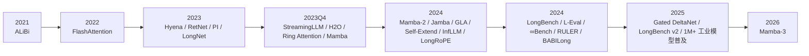

# 长序列与长文本能力发展的前沿综述

## 执行摘要

如果把 Transformer 及其更早的序列建模背景视为已知前提，那么过去五年里“长序列/长文本能力”的主线，其实已经从“把上下文窗口做大”转向了“让超长上下文在质量、成本、延迟和可评测性上都真正可用”。今天的前沿基本收敛到五条互相耦合的路线：其一，是需要改架构并重新预训练的路线，核心目标是摆脱 Transformer 在长上下文上的二次复杂度与 KV cache 线性膨胀；其二，是不改架构、尽量复用现有 Transformer 的推理时路线，围绕 KV cache、滑窗、外部检索、prompt 组织与上下文压缩展开；其三，是位置编码与长度泛化，尤其是围绕 RoPE 的插值、缩放和再参数化；其四，是系统层路线，重点在 IO、缓存、分布式并行与压缩；其五，是评测与基准，逐步从单针检索走向真实长文档理解、多跳推理与代码库/结构化数据场景。

就“谁最有可能挑战 Transformer 的统治地位”而言，Mamba 及其后续 Mamba-2、Mamba-3 是过去两年最重要的非 Transformer 主线。Mamba 的关键贡献不只是把复杂度从注意力的二次形式改成线性，而是通过 selective SSM 把“基于内容的选择性读写”重新引入线性递推模型，使其在语言建模这种信息密集型任务上第一次接近乃至局部超过同尺度 Transformer；Mamba-2 进一步用 state space duality 统一了 attention 与 SSM，并把核心层加速到比 Mamba 快 2–8 倍；Mamba-3 则明确转向 inference-first，试图在不牺牲低延迟的前提下修复状态表达力与 state tracking 的不足。与此同时，更大规模的实证研究开始表明：**纯 SSM/Mamba 并没有彻底赢下 retrieval、copying、in-context learning 和长程推理**，真正最稳的路线反而是少量注意力层与大量线性层的混合架构。

工业界这两年的共识也越来越清楚：大 context window 很重要，但它**不等于**长上下文能力，更不等于长程推理能力；“标称窗口长度”与“有效窗口长度”往往不同；即便模型支持 1M token，上下文越长，检索目标越多、推理链越复杂，退化依然显著；因此检索、chunking、reranking、prefix/prompt caching、server-side compaction 与 KV 压缩不会因为大窗口而消失，反而成为生产系统的默认配置。Anthropic、OpenAI 和 Google 的官方文档都在不同角度承认了这一点，而 RULER、BABILong、LongBench v2 等公开基准则把这种“窗口很大但有效使用比例不高”的现象系统化地量化了出来。

对课程 project 而言，最值得做的，不是试图覆盖全部历史，而是围绕一个明确问题做“可复现实证”：例如比较同一个开源模型在 NIAH、RULER、LongBench 子集上的表现差异；比较几种不改架构的 inference-time 方法；或者在小尺度上比较 Mamba、Transformer 与 hybrid 在长度扩展、吞吐、内存与 retrieval 之间的 trade-off。这类实验既能体现 survey 的前沿性，也更适合课程项目的资源约束。

## 时间线与研究框架

下面这张时间线把本报告的主线放在一起：一条是**架构路线**，从 Hyena/RetNet 走到 Mamba、Mamba-2、Gated DeltaNet 和 Mamba-3；一条是**无架构变化的推理路线**，围绕 StreamingLLM、Self-Extend、InfLLM、RAG/Contextual Retrieval 等展开；另一条是**系统与评测路线**，由 FlashAttention、PagedAttention、Ring/Context Parallelism 与一系列长上下文 benchmark 共同推动。相关里程碑见后文具体展开。

从今天的视角回看，这条时间线至少说明了三件事。第一，**长文本能力已经不再只是“模型架构问题”**，而是“架构 + 编码 + 推理时算法 + 系统 + 评测”的联动问题；第二，**近两年的创新重心明显前移到了 inference efficiency 与 effective context**，也就是“怎样把长上下文真正用起来”；第三，**Mamba 之所以重要，并不是因为它已经全面胜过 Transformer，而是因为它第一次把‘线性复杂度 + 语言建模竞争力 + 真实系统收益’三件事合到了一起**，迫使整个社区重新审视“是否真的需要每一层都保留全量 KV cache 的注意力数据库”。

## 需要架构变化与重新预训练的方法

### 从 Hyena 到 Mamba-3

在你给出的分类里，这一大类的共同点不是“改一点 attention kernel”，而是**模型本体变了，通常需要从头预训练或至少做大规模持续预训练**。这类方法真正关心的，是如何在不保留完整注意力矩阵与不断增长的 KV cache 的前提下，仍然保留或重建长程依赖、状态更新和内容选择能力。

| 代表方法 | 核心思想 | 是否需重训 | 长度/复杂度行为 | 论文给出的代表性结果 | 主要优势 | 主要局限 |
|---|---|---|---|---|---|---|
| Hyena Hierarchy 2023  | 用隐式长卷积 + data-controlled gating 取代 attention | 是 | 次二次；在 64K 处显著加速 | 在数千到数十万 token 的 recall/reasoning 上优于多种早期次二次方法；64K 时较优化 attention 快 100× | 长序列吞吐好，证明“非注意力”也能做语言建模 | 训练与实现仍较专门化；工业生态不如 Transformer |
| RetNet 2023 | 把 attention 重写成 retention，统一 parallel / recurrent / chunkwise recurrent 三种计算 | 是 | 训练可并行，解码 O(1)，chunkwise 线性 | 强调 low-cost inference 与长序列 chunkwise 建模 | 概念清晰，兼顾训练并行与部署效率 | 摘要没有给出统一超长上下文上限；后续影响力被 Mamba 抢走 |
| Mamba 2023 | selective SSM：输入驱动的状态更新，重新获得 content-based selectivity | 是 | 线性时间；固定大小状态；无 KV cache | 推理吞吐比 Transformer 高 5×；真实数据上性能持续提升到 million-length；3B 模型优于同尺寸 Transformer、匹配 2× 参数 Transformer | 第一次把纯 SSM 做到语言建模可竞争 | retrieval/copying/ICL 仍弱于注意力，后续大规模比较证实这一点 |
| Mamba-2 2024 | 用 state space duality 统一 Transformer 与 SSM；更快的核心层 | 是 | 仍是线性递推，但核心层更硬件友好 | 核心层较 Mamba 快 2–8×，并保持与 Transformer 竞争 | 理论统一度更高，训练效率显著改进 | 纯 Mamba-2 仍未彻底解决 retrieval/long reasoning 短板 |
| GLA 2024 | 线性 attention 加 data-dependent gate，并做成硬件友好的 FlashLinearAttention | 是 | 线性推理；训练吞吐高 | 2K 训练可泛化到 20K+；训练吞吐高于同尺寸 Mamba | 是“attention 侧”对 Mamba 的有力回应 | 仍属于 attention 系列边界方法，不是完全脱离 Transformer |
| Jamba 2024 | Transformer + Mamba + MoE 的 production-grade hybrid | 是 | 借 Mamba 降低长上下文 memory/latency | 支持 256K context；可在单张 80GB GPU 上容纳约 140K；长上下文吞吐比 Mixtral 8x7B 高 3× | 说明工业界更看好 hybrid 而非纯替代 | 架构复杂，工程栈更重，优化依赖专用 kernel |
| Gated DeltaNet 2025 | 结合 gating 与 delta rule 的线性递推模型 | 是 | 线性推理，强调 retrieval/long-context 改善 | 在语言建模、ICL、长度泛化、长上下文理解上优于 Mamba-2/DeltaNet | 是 Mamba 系列最直接的同代挑战者之一 | 摘要层面仍缺少生产级大规模验证 |
| Mamba-3 2026 | inference-first：更丰富递推、复状态更新、MIMO、RoPE/QKNorm 重构 | 是 | 低 decode latency；状态更强 | 1.5B 尺度下较 Gated DeltaNet 平均下游准确率再高 0.6–1.8 点；prefill+decode 在 H100 上优于 Mamba-2/GDN/Llama-3.2-1B | 把“线性模型是否真的能赢部署”推到新高度 | 目前公开结果仍主要在 1.5B 级别，尚未证明能全面取代 frontier Transformer |

从这张表可以看出，真正的前沿不是“纯 SSM 一路碾压 Transformer”，而是两种更细的趋势。第一，**线性/递推模型正在快速补齐选择性和状态表达力**；第二，**最有工程可行性的形态往往是 hybrid**，也就是少量全局注意力负责精确检索，大量线性层负责压缩记忆、控制 latency 与 memory。这个结论并非抽象判断，而是被 Jamba 的工业实践与 NVIDIA 对 8B 模型的控制变量实验同时支持。

### Mamba 专题

Mamba 的核心不在于“把 attention 删除了”，而在于它抓住了早期 SSM/线性模型失败的关键原因：**它们没有足够强的 content-based selectivity**。Mamba 通过让 SSM 参数随输入变化，把“保留/忘记/更新什么”的决策放回 token 级别，从而让固定状态不再只是机械压缩器，而更像一个受内容驱动的可学习记忆单元。原始论文把这一机制称为 selective SSM，并配套设计了 hardware-aware 的并行 scan 算法；官方实现显示，Mamba block 的关键超参数包括 `d_state`、`d_conv` 与 `expand`，并依赖专门的因果卷积和 CUDA 内核。

从训练配方看，Mamba 并不是“免费替代”. 你不能像在现有 Transformer 上那样只改推理逻辑，它通常需要**从头训练或大规模持续预训练**，而且对数值稳定性与 kernel 实现更敏感。官方仓库明确给出了从 130M 到 2.8B 的预训练与 benchmark 脚本，并强调其模型对精度与初始化较敏感；这说明 Mamba 在研究上已经可复现，但其训练-部署生态仍明显不如 Transformer 成熟。

Mamba-2 的意义在于，它不是简单“把 Mamba 做快一点”，而是给出了一套把 Transformer 与 SSM 放在同一数学框架下理解的 state space duality。论文直接声称 Mamba-2 的核心层比 Mamba 快 2–8×，同时仍保持语言建模竞争力。到 2024 年，随着这条线被更多工作跟进，讨论焦点已经从“SSM 是否可能有效”转成了“在什么任务、什么尺度、什么部署条件下，SSM/Hybrid 比 Transformer 更合算”。

真正把这件事做实证化的是 NVIDIA 的控制变量研究。该工作把 8B 参数的 Mamba、Mamba-2、Transformer 和 Mamba-2-Hybrid 放在相同数据与训练预算上比较，训练数据规模到 3.5T tokens。结论非常关键：**纯 Mamba/SSM 在很多标准任务上可以匹配甚至超过 Transformer，但在 copying、in-context learning 和 long-context reasoning 上会落后；而只加入少量 attention 的 hybrid 模型则在 12 个标准任务上全面超过 8B Transformer，平均高 2.65 分，并在生成时预测可快到 8×。** 这基本奠定了今天对 Mamba 最稳妥的理解：它不是立即替代一切的“新 Transformer”，而是把最昂贵的那部分注意力稀释到最少，同时尽量保住精确检索能力。

Mamba-3 则进一步把这个问题改写成“如果推理时计算已经成为主导瓶颈，那么线性模型该如何为推理而设计”。作者明确提出三项改动：更丰富的递推形式、复数值状态更新、以及几乎不增加 decode latency 的 MIMO 形式；同时在架构上加入 QKNorm、移除 Mamba-1/2 中的短卷积，并引入 RoPE 风格的旋转表达以实现 complex-valued SSM。更重要的是，作者在单张 H100 上给出了 1.5B 模型的 latency 表：在 prefill+decode 设置下，16,384 token 时 Llama-3.2-1B 需要 976.50 秒，而 Mamba-3 SISO 只需 140.61 秒，Mamba-2 为 149.02 秒，Gated DeltaNet 为 145.87 秒；与此同时，Mamba-3 的 MIMO 版本还能再提升约一个百分点以上的下游准确率而不显著增加 decode latency。

但 Mamba-3 的作者自己也承认一个关键事实：**线性模型天然处在 fixed-size state 与 Transformer 不断增长的 KV cache 之间的结构性 trade-off 中**。前者带来线性复杂度和低延迟，后者带来近似“数据库式”的精确检索。因此他们甚至预测，至少在语言建模里，未来线性层大概率会与全局 self-attention 共同使用，而不是单独统治。对于你的 survey，这一点非常值得强调，因为它解释了为什么 Mamba 既是“挑战 Transformer 统治”的核心力量，又尚未成为“彻底终结 Transformer”的最终答案。

### 为什么 Mamba 真正挑战了 Transformer 的统治地位

第一，它把**解码态从“长度线性增长的 KV cache”改成了“固定大小状态”**。这意味着在 agent、流式处理、超长对话和大代码库分析等 decode-heavy 场景里，Mamba 的潜在 memory 优势是结构性的，而不是工程上微调 kernel 后才出现的偶然收益。

第二，它迫使研究者重新理解“长上下文能力”的构成。Transformer 过去之所以像不可替代，部分原因是大家默认“精确检索 + 长程依赖 = attention”。Mamba 证明至少语言建模的一大部分能力可以由 selective recurrence 实现；Mamba-2 又证明了 attention 与 SSM 在更深层其实并不对立；Mamba-3 则表明即便在线性模型内部，也还远没到结构创新的天花板。

第三，它改变了工业设计空间。Jamba 这样的 production-grade hybrid 已经说明，只要把少数 attention 层放在最需要检索的位置，再用 Mamba 来承担多数层的状态压缩与推理效率，就有机会在 256K 级上下文、单卡部署与吞吐上同时拿到好处。这不是纯学术 speculation，而是已经被开源权重、模型卡和工业博客验证过的具体路线。

## 不需要架构变化的方法

### 推理时延展、滑窗、KV 管理与提示工程

这一路线的共同点是：**不改预训练架构，尽量利用现成 Transformer**。最典型的代表是 StreamingLLM、Self-Extend、InfLLM，以及工业界围绕 prompt 组织、prefix reuse 和 cache 管理形成的一整套惯例。它们不要求从头预训练，因此在研究成本和工程落地上都更友好，也更适合课程项目。

| 方法 | 是否改架构 / 重训 | 核心思想 | 长度行为 | 代表结果 | 主要代价 / 风险 |
|---|---|---|---|---|---|
| StreamingLLM 2023 | 否 / 否 | 仅保留近期窗口 + 初始 attention sink token 的 KV | 面向“无限流式”而非一次性全局读全 | 可稳定到 4M+ token；较滑窗重算快至 22.2× | 更适合 streaming，不等于强全局推理 |
| Self-Extend 2024 | 否 / 否 | grouped attention + neighbor attention 的双层推理时 attention | 直接把原模型推到更长窗 | 论文在多个 benchmark 上证明免微调延展有效 | 仍受原模型表征上限约束，复杂 reasoning 改善有限 |
| InfLLM 2024 | 否 / 否 | 为远端上下文建高效 memory units，按 token 相关性回看 | 可扩到 1,024K | 无训练即可与长上下文持续训练基线可比 | 记忆检索策略本身变成新的系统复杂度 |
| 传统滑窗 / chunking | 否 / 否 | 只保留局部窗口，必要时总结历史 | 理论上无限，但信息会丢 | 工业上仍常用 | 对跨块推理和完整引用非常脆弱 |
| Prompt engineering for long context | 否 / 否 | 指令位置、引用提取、显式文档结构 | 不改变可处理长度，但改善有效利用率 | Anthropic 与 OpenAI 都报告明显收益 | 高度依赖任务与模板，泛化有限 |

Anthropic 和 OpenAI 的官方建议非常值得写进 survey，因为它们其实概括了工业界对“长上下文 prompt 应该怎么写”的共识。Anthropic 2023 年的长上下文提示实验表明，在长文档问答里，**先抽取相关引用再回答**、以及**提供同类问题示例**，都能显著提高 recall；OpenAI 的 GPT-4.1 提示指南则明确建议，在长上下文情境下，把 instructions 同时放在上下文开头和结尾通常优于只放一处；对于大量文档输入，XML 或 `ID | TITLE | CONTENT` 这类清晰结构往往优于 JSON。

这些建议背后的含义是：**有效长上下文能力并不只由模型决定，也由“你怎样把证据组织给模型”决定**。这也是为什么“prompt engineering”在长文本任务上并没有因为更大窗口而失效，反而更加重要。Google 的 Gemini 长上下文文档同样指出，1M token 让 many-shot in-context learning 成为可能，但当需要检索多个 needle 或做复杂全局推理时，性能会明显下降；Anthropic 的 API 文档则直接提醒“more context isn’t automatically better”，并把这种退化称为 context rot。

### RAG、长块检索与工业共识

另一个不改架构但极其重要的方向，是把长上下文能力与检索增强结合起来。RAPTOR 的思路是，不再只检索短的连续 chunk，而是先对 chunk 做递归聚类和抽象摘要，形成多层树结构，这样推理时既能拿到局部证据，也能拿到更高层的文档语义摘要；该方法在 QuALITY 上把 GPT-4 的最佳结果绝对提升了 20%。

LongRAG 更进一步，反过来利用“读者模型已经有长上下文能力”这一事实，直接把 retrieval unit 从 100 词左右的短段，提升到 4K token 甚至“整篇文档”级别。作者的核心判断是：传统 RAG 存在“heavy retriever + light reader”的结构失衡；既然 reader 已经变强，就应该让 retriever 面对更大的语义单元。实验中，LongRAG 在不训练的情况下，在 NQ/HotpotQA 上达到与全训练 SoTA 接近的结果，并在 Qasper、MultiFieldQA-en 上优于短块切分。

Anthropic 的 Contextual Retrieval 反映了工业界对这件事的最新理解。它指出，传统 RAG 的主要问题是 chunk 在 embedding 前被剥离了上下文，于是检索器拿到的是“失去出处的句子”；其解决方式是在每个 chunk 前自动生成 50–100 token 的 chunk-specific context，并同时走 contextual embeddings 与 contextual BM25。Anthropic 报告说，这会把 top-20 retrieval failure rate 降低 49%，加 reranking 后可降低 67%。更重要的是，Anthropic 还给了一个非常实用的经验边界：如果知识库小于约 200K token，其实可以直接整库放进 prompt，而不一定要上 RAG。

这几项工作合在一起，可以概括出一个很“工业”的结论：**大窗口不是 RAG 的替代品，而是 RAG 设计空间的重写器**。过去 RAG 是“小窗口下的不得已”；现在长上下文让我们可以使用更大的语义单元、更重的 reranking、更复杂的多文档选择策略，甚至在小到中等知识库上直接“all in context”。但一旦知识库继续增长、请求重复出现、延迟与成本变得敏感，检索、缓存和重排仍然是默认配置。

## 位置编码与长度泛化

对现代 NLP 研究者而言，这一块不需要回顾所有位置编码历史，只需要抓住仍然活跃讨论的三条代表性线索：**ALiBi、Position Interpolation、YaRN**；LongRoPE 可以被看作这些思想在超长窗口上的工程化延伸。

ALiBi 的重要性在于它给出了一种极简但非常有启发性的答案：位置不一定要以 embedding 的形式加到 token 上，也可以直接通过对 query-key 分数加与距离成比例的线性 bias 来表达相对位置。原论文显示，一个 1.3B 参数模型在 1024 长度训练后可以外推到 2048，并达到和在 2048 长度上用正弦位置编码训练的模型相同的困惑度，同时训练还快 11%、省 11% 内存。即便今天大模型实践主要围绕 RoPE，它仍然是“length extrapolation 可以来自 inductive bias，而不一定来自更复杂编码”的重要参照物。

Position Interpolation 则是 RoPE 时代真正奠基性的工作。它的核心不是“外推新位置”，而是把更长序列的位置索引线性压缩回原始训练区间，于是避免了 RoPE 外推时注意力分数爆炸的问题。作者在 LLaMA 7B–65B 上只用约 1000 步微调就把窗口扩到 32,768，同时较好保持原短窗口性能；理论分析还指出，插值的上界至少比直接外推稳定约 600×。这一思想几乎奠定了后来一系列 RoPE 扩窗工作的基本范式。

YaRN 是 Position Interpolation 之后最具代表性的“高性价比 RoPE 扩窗”方案之一。它的价值不在于提出一个完全不同的数学对象，而在于把扩窗这件事进一步工程化：在摘要中，作者直接声称相较此前方法，YaRN 需要 10× 更少 token、2.5× 更少训练步数，就可把 LLaMA 类模型扩到远超原生预训练长度的上下文，并且还能继续外推超出微调数据长度的范围。也正因为这种“低成本、兼容 RoPE、兼容现有基础设施”的特征，YaRN 在后续开源社区里影响非常大。

LongRoPE 可以视为这一系列思路在“超大窗口”上的一次激进工程化。它通过对 RoPE 做**非均匀重缩放**，并配合搜索与 progressive extension，把预训练 LLM 的窗口首次扩到 2,048K token；而 GitHub README 又补充说明，该方法后来集成到 Microsoft Phi-3，支持 128K 系列模型，并把“搜索初始化 + 渐进延展 + 短窗口重校准”总结成了三步工作流。对 survey 来说，LongRoPE 的意义不只是“窗口做得大”，而是它说明**位置编码扩窗已经从论文 trick 变成了工业模型产品化的一部分**。

这一类工作的总体经验可以浓缩成一句话：**位置编码方法决定的是“能不能把长度送进去”，而不是“模型是否真的理解了这些长度上的信息”**。LongBench、RULER、BABILong 等后续基准都反复证明了这一点：窗口扩到 128K、1M 甚至更长，并不自动带来比例相称的长程检索或推理能力。

## 系统层路线

如果说架构路线解决的是“理论上如何避免长度爆炸”，那系统路线解决的就是“同样的模型，为什么在机器上跑不起来、跑不快、跑不起”。从 2022 年开始，这条路线的主旋律其实非常稳定：**IO-aware attention、KV cache 内存管理、分布式长序列并行，以及 KV 压缩/缓存复用**。

| 系统路线 | 解决的问题 | 代表结果 | 对长上下文的意义 |
|---|---|---|---|
| FlashAttention 2022 | 标准 attention 的 HBM/SRAM IO 过大 | GPT-2 1K 训练快 3×；LRA 1K–4K 快 2.4×；Path-X 16K/64K 首次超随机 | 证明“精确 attention 也可以靠 IO-aware kernel 变长” |
| FlashAttention-2 2023 | FlashAttention 仍未充分榨干 GPU 并行 | 比 FlashAttention 再快约 2×，A100 上到 50–73% 理论峰值 | 把长上下文 attention 的可训练性大幅提升 |
| PagedAttention / vLLM 2023 | KV cache 碎片化与共享低效 | 同延迟下吞吐提升 2–4× | 让长 prompt、长对话、更大 batch 更现实 |
| RadixAttention / SGLang 2024 | 多次调用间相同前缀无法自动复用 | 多类工作负载上相对 vLLM/Guidance 吞吐最高可达 5× | 长程序 agent、few-shot、大前缀任务收益极大 |
| Ring Attention 2023 + Context Parallelism | 单卡内存无法承载超长序列训练/推理 | Ring Attention 支持 millions of tokens；NVIDIA CP 按序列维切分激活 | 真正把“百万级上下文”变成多卡系统问题 |
| H2O / KIVI / SnapKV | KV cache 成为显存与带宽瓶颈 | H2O 吞吐可至 29×；KIVI 2bit 量化带来 2.35–3.47× 吞吐与 2.6× 峰值内存下降；SnapKV 16K 输入时解码快 3.6×、内存效率高 8.2×，可在单张 A100-80GB 上到 380K | Long-context inference 的“最后一公里”主要靠压缩和缓存策略 |

FlashAttention 的历史地位必须强调，因为它说明了一件常被忽略的事实：**很多长上下文瓶颈并不是理论复杂度先决定的，而是 memory hierarchy 先决定的**。原论文把 attention 看成 IO 问题而非纯 FLOPs 问题，由此带来真实速度和显存的大幅改善；FlashAttention-2 进一步把 thread block 与 warp 的工作划分做到更合理，使得这个方向从“好的 kernel”变成“现代 Transformer 的默认训练/推理基础设施”。

vLLM/PagedAttention 与 SGLang/RadixAttention 则代表了服务系统侧的分化。前者更像“把 KV cache 当虚拟内存管理对象”，主要解决碎片、共享与 batch 效率；后者更像“把程序里的前缀共享模式系统化”，自动在多轮调用间复用 prefix KV。对于课程 report 来说，一个很好的观点是：**长上下文系统已经从单次 forward 的优化，扩展到跨请求、跨会话、跨子程序的缓存编排问题**。

KV 压缩工作则让“无架构变化”的路线变得更有生命力。H2O 证明并非所有 token 在注意力中都同等重要；KIVI 进一步把 key/value 的分布差异做成了非对称 2bit 量化；SnapKV 则利用“attention head 在生成时集中关注特定 prompt 区域”的现象，用 observation window 估计重要位置并压缩 cache。它们的共同信息是：**就算模型本体不变，long-context inference 的可用窗口长度依然可以被系统方法推高一个量级。**

工业文档也在把这些技术产品化。OpenAI 的 prompt caching 文档明确写到，缓存命中可把延迟最高降低 80%、输入成本降低 90%，并说明 extended prompt caching 的本质是把 prefill 产生的 key/value tensors 持久到 GPU 本地存储；Anthropic 的 Claude 文档则把 server-side compaction 作为长会话和 agentic workflow 的主策略。这些都说明，**系统层的“长上下文”已经不再只属于推理引擎论文，而是 API 产品的显式能力。**

## 评测与基准

长上下文评测过去最大的问题，是大家把“能从很长 prompt 里捞出一个 needle”误当成了“模型有长文本理解能力”。过去两年最重要的评测进展，恰恰就是不断拆穿这一误解。

| 基准 | 核心测什么 | 长度范围 | 最重要的启示 |
|---|---|---|---|
| Needle in a Haystack | 单针检索、文中位置鲁棒性 | 可自定义 | 只能做 sanity check，不能代表多跳理解 |
| RULER 2024 | 多针、聚合、多跳 tracing 的合成测试 | 4K 到 128K+ | 标称窗口 ≠ 有效窗口；很多模型在 vanilla NIAH 几乎满分，但上 RULER 显著掉点 |
| L-Eval 2024 | 真实长文档问答 + 评测指标方法学 | 3K–200K tokens | n-gram 指标与人评相关性差，LLM-as-a-judge 更合理 |
| LongBench 2024 | 英中双语多任务长上下文理解 | 平均 6,711 英文词 / 13,386 中文字 | retrieval/compression 能帮弱模型，但仍不如强 long-context 模型 |
| ∞Bench 2024 | 100K+ 长度上的真实与合成任务 | 平均超过 100K | 100K 以上能力仍有明显缺口 |
| BABILong 2024 | 极长上下文中的分布式事实推理 | 到 10M，扩展可到 50M+ | 现有模型往往只有效利用 10–20% 上下文；长 reasoning 远难于长 retrieval |
| LongBench v2 2024/2025 | 真实多任务深理解与推理 | 8K–2M words | 长上下文下一步瓶颈是 reasoning 与 inference-time compute，而非单纯窗口长度 |

RULER 是这里最“方法论化”的工作。它把 NIAH 从单针检索扩展到多针、聚合、多跳 tracing 和复杂度可调的合成任务，结果表明：很多自称支持 32K 以上上下文的模型，只有一半能在 32K 维持“满意表现”；其 GitHub 主表甚至明确给出“claimed length”和“effective length”的区分，这对于 survey 非常重要，因为它提供了一个定义“有效上下文长度”的实证框架。

L-Eval 与 LongBench 则把评测往更真实的场景推。L-Eval 的贡献不仅是数据，还包括评测方法本身：作者指出传统 n-gram matching 对长文档开放式回答并不可靠，主张使用 length-instruction-enhanced 评测与 LLM judges。LongBench 则通过 21 个数据集、6 类任务、英中双语设置，比较系统地说明：位置嵌入缩放与长序列微调确实有效，而 retrieval/compression 对弱长文本模型有帮助，但仍不足以替代强 long-context model。

∞Bench、BABILong 和 LongBench v2 基本代表了今天评测的三种更高难目标。∞Bench 把平均长度直接推到 100K 以上；BABILong 则故意让所需事实散布在极长自然文本中，并报告流行 LLM 实际上只有效利用了 10–20% context；LongBench v2 进一步把单文档、多文档、长对话、代码库与结构化数据理解统一在 8K–2M words 的多项选择任务里，并发现最强“直接回答型”模型只有 50.1% 准确率，而带更长推理的模型可到 57.7%，超过 15 分钟时间限制下的人类 53.7%。这说明今天真正稀缺的，不是“窗口够不够长”，而是“在超长上下文中做深层 reasoning 的能力”。

截至 **2026-05-24**，LongBench v2 项目页公开排行榜上，带 CoT 的 Gemini-2.5-Pro 和 Gemini-2.5-Flash 分别达到 63.3% 和 62.1% 总准确率，项目方把这类结果直接解读为“推理能力和 inference-time compute scaling 对长上下文问题至关重要”。这与 OpenAI 在 GPT-4.1 发布中引入 Graphwalks 这类多跳长上下文基准、以及官方文档强调“复杂图搜索/多项检索会随长度退化”的观察是高度一致的。

## 课程项目实验建议

下面的建议默认你们**没有给出具体 GPU 规格**，因此我按“1–4 张 24GB 消费级 GPU，或 1 张 80GB A100/H100”做了分层设计。如果资源更紧，可以优先做前两个；如果资源充裕，再做第三或第四个。相关 benchmark 和可用模型都已有公开实现或官方脚本支持。

| 实验 | 目的 | 推荐设置 | 资源估计 | 指标 | 预期结果 |
|---|---|---|---|---|---|
| 同一模型上的“检索 vs 推理”断层实验 | 证明长上下文问题不等于单针检索 | 选一个开源 7B/8B 模型；跑 NIAH、RULER 子集、LongBench/LongBench v2 小子集 | 1×24GB 量化或 1×80GB 全精度 | 准确率-长度曲线、TTFT、tokens/s | NIAH 往往显著高于 RULER/LongBench，多跳任务更快退化 |
| 不改架构的 inference-time 方法对比 | 比较哪类“廉价方法”最值得工业使用 | 在同一 RoPE 模型上比较 baseline、StreamingLLM、Self-Extend、InfLLM | 1×80GB 最稳；小模型可 1×24GB | 精度、峰值显存、prefill/decode 吞吐 | Self-Extend/InfLLM 会明显拉长有效长度；StreamingLLM 在流式任务上延迟最好，但全局 reasoning 未必最强 |
| 小尺度 Mamba vs Transformer vs Hybrid | 复现“线性模型效率强，但 retrieval/ICL 弱；hybrid 更稳” | 用官方 `mamba-130m/370m`、`mamba2-*`、`transformerpp-*` 或 `mamba2attn-*`，在合成 retrieval + lm-eval 子集上评测 | 1–2×24GB 即可，或 1×80GB 更轻松 | 零样本任务分数、生成吞吐、显存、context scaling | 纯 Mamba 吞吐与显存更优，hybrid 通常最均衡 |
| 系统路线复现 | 把“长上下文能力”拆成“模型能力”和“服务能力” | 对比 HF baseline、vLLM、SGLang；测试长前缀重复请求 | 1×80GB 或 2×24GB | TTFT、throughput、cache hit、显存占用 | vLLM 与 SGLang 相对基础实现有明显吞吐优势；重复前缀场景收益最大 |
| 小规模位置扩窗实验 | 展示“扩窗”和“真正理解”是两回事 | 对一个小 RoPE 模型做 PI/YaRN 或直接用 LongRoPE 开源实现，评测 passkey、RULER 和 LongBench 子集 | 若需要微调，建议 1×80GB；纯推理可更低 | passkey、RULER、LongBench 的相对提升/退化 | NIAH/passkey 提升会比真实任务更大，从而形成很好的论文论点 |

如果你们希望 project 更“像一篇前沿 survey + 一个扎实实验”，我最推荐的题目组合是下面这一个：

### 最推荐的课程项目方案

选一个中等开销的开源模型，做一条非常清晰的主线：

**“长上下文能力到底是 retrieval 问题、reasoning 问题，还是系统问题？”**

具体做法是：

1. 用同一个模型，在 **NIAH / RULER / LongBench 子集** 上做三档 evaluation。  
2. 再加一个 **inference-time 方法** 对比，例如 baseline vs Self-Extend vs InfLLM。  
3. 最后用 **vLLM 或 SGLang** 测一下 latency/throughput。  

这样你们的报告会非常完整：前半部分 survey 讲“学界/工业界怎么分类”，后半部分实验用同一模型把“窗口长度、有效长度、推理深度、系统吞吐”四件事拆开。这个设计的优点是：不需要从头训大模型，但结论会非常有说服力，而且能直接对应本文前面的核心论题——**长上下文不是一个单一维度的能力。**

### 写作时可以直接提出的开放问题

你们最后一节讨论，我建议围绕这几个开放问题收束：

Mamba 一类 fixed-state 模型，是否可以在不显著引入 attention 的情况下，真正补齐 retrieval 和 in-context learning 的短板？现有证据更支持“hybrid 更稳”而不是“纯线性模型已胜出”。

超长上下文 benchmark 是否已经足够真实？RULER 很适合测 effective length，BABILong 很适合测极长推理，LongBench v2 很适合测真实任务，但它们仍然没有完全覆盖 agent memory、工具调用、多轮对话 compaction 等生产情境。

工业界是否会走向“全部 1M+ context，少做 RAG”？现有官方文档几乎都给出了相反答案：更大窗口很重要，但随着成本、延迟、context rot、多 needle 检索和复杂 reasoning 的问题浮现，RAG、reranking、caching、compaction 仍然会长期存在。

从今天的研究图景看，最稳妥的总判断可以写成一句话：**长文本/长序列能力的发展，已经从“how to fit more tokens”演化为“how to keep useful state, retrieve the right evidence, and reason reliably under extreme context budgets.”** 在这场演化里，Mamba 是最重要的架构变量，RAG/缓存/压缩是最重要的工程变量，而 RULER/LongBench v2/BABILong 则是最重要的评测变量。把这三条线放在一起，基本就构成了一份面向现代 NLP 研究者的前沿 long-context survey。