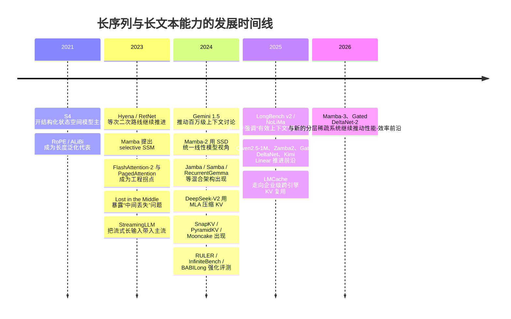
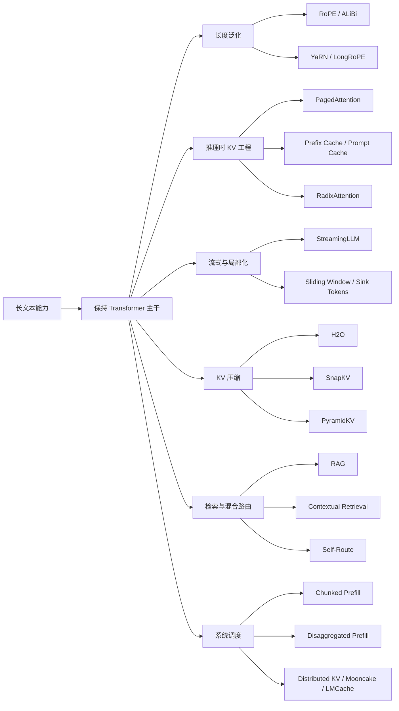

# 长序列与长文本能力发展综述

## 执行摘要

长序列/长文本能力在过去几年里已经从“把上下文窗口做大”演变为一个更复杂的研究与工程问题：一方面，研究界在探索能否用**次二次甚至线性时间**的序列建模架构替代或部分替代标准注意力；另一方面，工业界逐渐形成了更务实的共识——**名义上下文长度不等于有效可用上下文长度**，而真正决定产品效果与成本的，往往是 KV cache 管理、前缀复用、检索路由、分布式调度与评测方法，而不只是模型卡上写的“128K/1M/2M”。RULER、Lost in the Middle、NoLiMa、LongBench v2 等评测都表明：模型在更长上下文里经常出现位置敏感、检索退化和深层推理退化，且衰减通常在达到“宣称窗口”之前就已开始。

从路线看，近三年最重要的分野不是“长上下文 vs 短上下文”，而是两大技术生态。第一类是**需要架构变化并重新预训练**的路线，包括 SSM/递归/线性注意力及其混合体：S4 开启了结构化状态空间模型的主线，Mamba 将选择性 SSM 推到语言建模前台，Mamba-2 给出 SSD 统一视角并推动硬件友好实现，随后出现了 Samba、Jamba、RecurrentGemma、xLSTM、Gated DeltaNet、Kimi Linear、Zamba2、Mamba-3 等模型，整体趋势非常明显：**纯线性/递归模型在效率上有优势，但要补足拷贝、检索和 in-context learning 的短板，最有效的办法通常是混合化，而不是彻底抛弃注意力。**

第二类是**不改变基础 Transformer 架构**的方法。这里最重要的不是再发明一种新注意力，而是围绕已有 Transformer 做“长上下文工程”：FlashAttention 系列降低训练与预填充内存成本；PagedAttention、前缀缓存、Prompt Caching、RadixAttention 让重复上下文的成本显著下降；StreamingLLM、滑动窗口、sink tokens 为流式/无限输入提供近似有界内存解；H2O、SnapKV、PyramidKV 等 KV 压缩方法在不同精度-成本点上折中；RAG、Contextual Retrieval、Self-Route 则把“全部塞进上下文”与“先检索再读”这两种范式统一到一个代价-效果权衡框架里。工业实践越来越倾向于**混合策略**：小到中等知识库直接长上下文塞入并配合缓存，大规模语料则使用检索、路由与多级缓存。

对现代 NLP 研究者而言，最重要的结论有三点。其一，**“长文本能力”至少应拆成四个子能力**：长距离检索、长距离聚合、跨段推理、流式记忆维护；不同路线在这四项上并不等价。其二，**评测必须同时报告名义上下文、有效上下文长度、位置鲁棒性和系统成本**；只看 Needle-in-a-Haystack 不够。其三，**短期最值得做的研究**既不是一味扩上下文，也不是简单追求线性复杂度，而是研究“何时该保留精确注意力、何时该压缩/检索/递归化”的**条件化混合策略**。

## 时间线与问题脉络

下图按时间线概括了长序列/长文本能力的发展。它把“长度泛化背景”“新架构路线”“工程与评测拐点”放在同一张图里，便于理解为何 2024 年之后的讨论中心从“如何把 RoPE 拉长”转向“如何把系统、缓存、检索与混合架构一起设计”。这一整理基于原始论文、官方代码和工业技术文档。



如果把问题再抽象一层，今天“长文本能力”的研究可以看成两个相互耦合的问题。第一个问题是**表示与计算**：如何在不做 $O(L^2)$ 全注意力的前提下保留足够的内容寻址与状态跟踪能力。第二个问题是**系统与任务分解**：面对大文档、多轮对话、代码库或外部知识库时，究竟应该让模型“全部读完”、只保留部分 KV、还是先检索再读。近三年的里程碑工作大多是在这两个问题的交叉点上推进。

作为 Transformer 背景线索，本文只保留三条今天仍最常被讨论的代表作。第一是 **RoPE**，因为现代长上下文 Transformer 大量依赖其旋转位置编码及其缩放变体。第二是 **ALiBi**，因为它代表了“训练短、测试长”的简单偏置式长度外推思路。第三是 **YaRN/LongRoPE** 这条 RoPE 伸缩线，它把“无须大改架构、通过继续训练或少量长上下文训练去拉长窗口”变成工业上高度可用的方案；后续如 LongRoPE2 进一步强调“有效窗口”而非仅仅名义放大。

## 需要改架构并重训的路线

### Mamba 主线为何成为核心

如果要在近三年的新架构里只选一条主线，Mamba 几乎是不可绕开的中心。其前史是 S4：S4 证明了结构化状态空间模型在长程依赖上可以既有理论可解释性，也有很强的经验性能，甚至在 Long Range Arena 上取得显著结果。真正让这条线进入语言建模主舞台的是 Mamba：它指出此前许多次二次模型不如注意力的关键弱点，在于**缺乏基于内容的推理能力**；而 Mamba 的做法是把 SSM 的若干参数做成**输入相关的选择性机制**，再用硬件友好的并行 scan 恢复训练吞吐。论文报告其在语言、音频、基因组等模态上达到或超过同规模 Transformer，并在语言建模上以 3B Mamba 匹配甚至超过更大 Transformer，同时保持线性时间与更高推理吞吐。

从实现角度看，Mamba 不是“一个公式”，而是一套紧密耦合的算法—内核—架构设计。官方仓库把核心分成三层：`ops/selective_scan_interface.py` 中的 selective scan、`modules/mamba_simple.py` 中的 Mamba block，以及完整的语言模型示例；安装上依赖 `mamba-ssm` 和可选的 `causal-conv1d`，并明确要求 Linux、NVIDIA GPU、PyTorch 1.12+、CUDA 11.6+。这说明 Mamba 的性能优势很大程度上来自**自定义算子与内核工程**，而不仅仅是理论复杂度变低。

技术上可以把 Mamba 理解成三件事的组合。第一，使用状态空间递推替代显式存储全部历史 token 的 KV，因此在自回归解码时，状态大小相对上下文长度是常数，而不是像标准注意力那样随历史长度线性增长。第二，通过输入相关的选择性参数让模型知道“哪些内容要写入状态、哪些内容应该遗忘”，这就是 selective SSM 的本质。第三，通过并行 scan 和重计算策略把原本递归的计算重新组织成适合 GPU 的块式计算；论文甚至指出，反向时重算某些中间状态比保存它们再读回 HBM 更快，原因在于 HBM 读写才是瓶颈。

### Mamba 深入技术剖析

在研究上，Mamba 最值得注意的优点并不只是线性复杂度，而是它把“**线性时间**”与“**语言建模质量**”第一次相对成功地捆到了一起。Mamba 论文在语言建模上显示出比先前次二次模型更强的表现，且在百万长度合成任务上保持稳定；RNN/SSM 在很长序列上的理论可扩展性终于开始接近实际可用。

但从 2024 年之后的大规模对比看，Mamba 的局限也非常明确。NVIDIA 的同配方大规模比较表明，8B 级纯 Mamba / Mamba-2 虽能在不少任务上匹配或超过 Transformer，但在**拷贝、电话簿检索、强 in-context learning、长上下文推理**等任务上仍落后于 Transformer；相对地，混入少量注意力层的 Mamba-2-Hybrid 在 12 个标准任务上平均超过 8B Transformer，并在额外 23 个长上下文任务上平均接近或超过 Transformer。RULER 也给出相似信号：非 Transformer 架构如 RWKV、Mamba 在复杂长上下文合成任务上仍明显落后。这里体现的不是“线性模型没用”，而是“**纯线性递归记忆尚未完整替代精确内容寻址**”。

Mamba-2 的重要性在于，它把这条路线从“经验上有效”推进到“结构上可统一”。其论文通过**Structured State Space Duality** 把 SSM、线性注意力和半可分矩阵联系起来，并给出更简单的 SSD 核心模块；官方仓库也明确提供了 `modules/mamba2.py`、更简单的 `mamba2_simple.py` 以及 `ssd_minimal.py`。从实现说明看，Mamba-2 的典型 `d_state` 取值是 64 或 128，这反映出它比初代 Mamba 更强调可控的状态扩展与工程可实现性。

到 2026 年，**Mamba-3** 进一步显示出这条路线仍在快速进化。其论文从“推理优先”视角提出更具表现力的递推、复值状态更新以及 MIMO 形式，在 1.5B 规模上相对 Gated DeltaNet 再提升下游平均准确率，并强调在检索与状态跟踪上进一步改善。这说明纯递归/线性模型的短板正在被更细粒度的状态设计持续修补。

### 与 Transformer 的比较与复现难点

和标准 Transformer 相比，Mamba 系列的优势可以概括成三点。首先，**解码内存随上下文长度增长更慢**，因为不需要按 token 存储完整 KV cache。其次，**长序列下的吞吐更好**，尤其中长输出生成场景更有优势。再次，**在流式或持续对话任务上更自然**，因为它天生是状态递推模型。

其缺点也同样具体。第一，**精确检索与拷贝式行为仍弱于注意力**，尤其当关键信息需要被精确定位、比较或多跳聚合时。第二，**生态尚不如 Transformer 成熟**：训练脚本、权重格式、内核实现、评测工具之间往往存在较强耦合。第三，论文中的强结果常常依赖**高度优化的自定义栈**——例如官方 Mamba repo 的 CUDA 依赖、Megatron-LM 中与技术报告对应的固定代码快照、混合层配置模式、并行配置匹配等。Megatron-LM 示例甚至明确指出，主分支代码已不兼容技术报告中的 Mamba2 检查点，使用时必须切换到固定快照；推理还要求 checkpoint 的 hybrid layer pattern 与模型并行配置严格一致。

因此，如果是课程或中等规模研究项目，我对 Mamba 的复现实用建议很明确：**优先做“小规模继续预训练 + 合成检索任务 + 长上下文推理评测”的组合，而不是从零复现 7B/8B 全配方训练。**这不是因为后者不重要，而是因为今天 Mamba 研究的难点已经不在“写出一个 Mamba block”，而在于**把它放进一个和内核、混精、并行策略、数据管线一致协同的训练系统**。这一点从官方 repo 的算子依赖和 Megatron-LM 的专门混合训练示例都能看得很清楚。

### 其他新架构与工业混合化共识

Mamba 之后最强的信号不是“人人都改成纯 SSM”，而是“**大家开始系统地混合注意力与递归/线性模块**”。这一点在 **Samba** 中非常典型：官方 README 直接把其结构写成 `Samba = Mamba + MLP + Sliding Window Attention + MLP`，并报告在 128K prompt 上相对 GQA Transformer 有 3.73 倍吞吐，在 64K streaming generation 上有 3.64 倍加速，同时保持极强的长检索能力。它代表了一种非常强的工业直觉：**远距离做压缩，近距离保留精确注意力。**

**Jamba** 与 **Zamba2** 则把这种混合化进一步带到开源工业模型层面。Jamba 的设计是把 Mamba 层与 Transformer 层交织，并加入 MoE；Hugging Face 文档明确指出其大约是“每 8 层里 1 层 Transformer”，而 AI21 官方文档强调其 256K 上下文和 Mamba-Transformer 混合结构。Zamba2 则在 1.2B、2.7B、7.4B 上报告相对同级开源模型更好的延迟、吞吐与内存效率，并公开了权重和数据。对研究者来说，这些工作共同说明：**长上下文时代的新架构最可能胜出的形态是 hybrid，而不是 one-shot replacement。**

**RecurrentGemma** 和 **xLSTM** 则代表“回到递归，但不是回到旧 RNN”。RecurrentGemma 基于 Griffin，把 gated linear recurrences 与 local sliding-window attention 结合起来；Google DeepMind 公开页面明确声称它在更少内存下达到与 Gemma 接近的性能，并在长序列生成上有更高吞吐。xLSTM 则通过指数门控与 matrix memory 把 LSTM 重新包装成可与 Transformer/SSM 比较的现代架构，并且已经开源了 7B 版本与专门内核。它们说明：**“递归”并未死亡，而是正在以新的数值稳定与硬件友好形式回归。**

在更前沿的 2025–2026 工作中，**Gated DeltaNet** 与 **Kimi Linear** 很值得特别关注。Gated DeltaNet 结合 gating 与 delta rule，并在 ICLR 2025 论文中报告优于 Mamba2 与 DeltaNet；官方仓库还强调 FLA 内核更快并支持 varlen 训练，说明线性注意力路线也在迅速内核化。Kimi Linear 则把这条线推进到一个更激进的位置：其论文与官方 repo 都报告基于 KDA 与 MLA 的 3:1 混合架构，在长、短、RL scaling 场景都超过全注意力基线，并在 1M 上下文下把 KV 需求最多降低 75%、解码吞吐提高最多 6 倍。这里最值得研究者注意的是：**最新的工业模型并没有在“全注意力”和“全递归”之间二选一，而是在不同层级同时使用压缩注意力、线性递推与少量全局注意力。**

工业界的另一条重要路线是 **DeepSeek 的 MLA**。它仍属于注意力范式，但通过把 KV 压缩到 latent vector，大幅降低了解码阶段的带宽与缓存压力；DeepSeek-V2 报告 KV cache 缩减 93.3%，最大生成吞吐提升到 5.76 倍。这条路线与 Mamba/线性注意力并不冲突，反而在 Kimi Linear 一类工作中已经开始与线性模块混合。换言之，**现代长上下文架构前沿已经从“替代注意力”转向“重新设计状态表示”。**

## 保持 Transformer 架构的方法

下图把不改基础 Transformer 架构的长上下文技术生态做了关系整理。严格说，其中少数方法可能需要继续训练或长上下文微调，但它们都不要求你把主干模型从 Transformer 改写成另一种序列混合器；因此从工程决策视角，它们属于同一个工具箱。



### KV cache、前缀复用与长上下文工程

这一类方法是工业界最稳定、最常用、也最容易低风险落地的长上下文优化。其核心逻辑很简单：对于 Transformer，自回归生成真正昂贵的部分往往不是参数本身，而是**随上下文长度线性膨胀的 KV cache** 以及它带来的 GPU 内存碎片、带宽压力与调度成本。PagedAttention 正是为此提出：它把 KV 视为分页对象进行管理，在论文中报告相对现有系统达到 2–4 倍吞吐提升，并显著减少碎片与重复拷贝。

在此基础上，工业系统进一步强化了**前缀复用**。vLLM 的自动 prefix caching 把已计算过的 KV block 作为哈希块存起来，并在块池、空闲队列和映射表上做 O(1) 级别的块移动与回收；文档还引入 `cache_salt` 来限制跨用户重用，避免时延侧信道。SGLang 的 RadixAttention 进一步把 prompt 与已生成部分都放入 radix tree 中，以 prefix search + LRU 的方式复用 KV，并与 continuous batching、paged attention 兼容。两者都在说明一个工业共识：**如果业务存在重复 system prompt、few-shot prefix、chat history 或 tree-of-thought 分叉，那么“缓存命中率”本身就是一等公民指标。**

进一步地，API 供应商直接把这种思路产品化。OpenAI 的 Prompt Caching 文档明确指出：对 1024 tokens 以上的长 prompt，系统会自动做前缀路由与缓存命中；静态内容应放在 prompt 最前面，动态内容放在后面；命中时延迟最多可降 80%，输入成本最多可降 90%。Anthropic 的 Contextual Retrieval 文章也反复强调，prompt caching 使得“整段长文档重复使用”的路径显著更快、更便宜。对研究者与工程师而言，这意味着**context engineering 已从“写提示词”升级为“设计可缓存的上下文结构”**。

### 滑动窗口、流式处理与 KV 压缩

当上下文更长且重复性不高时，仅靠前缀缓存不够，第二类常见思路是**让模型只保留一部分历史**。StreamingLLM 是代表作：它发现 attention sink tokens 在流式设置中扮演稳定锚点作用，通过保留 sinks 与局部窗口，可以让原本只在有限窗口训练的 LLM 无需微调而稳定处理 4M 以上输入。它从根本上说明，许多长输入场景并不要求“精确保留所有 token 的可寻址性”，而要求“以极小的永久记忆保存稳定语境”。

在推理系统中，这种思想通常以**sliding window/cyclic KV cache + sink tokens** 形式出现。TensorRT-LLM 运行时直接支持 `max_attention_window_size` 与 `sink_token_length`，并把它们视为控制滑窗与循环 KV 行为的核心参数。这类方法非常适合日志流、持续对话、实时文档滚动读取等近因更重要的任务，但对需要精确回想很久之前字串的任务并不安全。

第三类方法是**KV 压缩/淘汰**。H2O 提出 recent + heavy hitters 的缓存保留策略，在论文中报告可带来最高 29 倍吞吐提升和最高 1.9 倍时延下降。SnapKV 则利用“每个头在生成前已经暴露出将来关注模式”这一经验规律，在观察窗口上选出重要位置并聚类压缩，报告在 16K 输入下可实现 3.6 倍生成加速、8.2 倍内存效率提升，且单张 A100-80GB 可处理 380K 上下文。PyramidKV 再进一步提出层间动态预算分配：低层保留更多 KV，高层更 aggressively 压缩，在 LongBench 上仅保留 12% KV 仍可接近 full cache。

这类方法的工业价值很高，但研究上必须特别小心两个误区。第一，压缩方法通常首先受益于**解码与显存**，而不是 prefill FLOPs；因此它们对长输入短输出和长输入长输出的收益不同。第二，简单 NIAH 往往会高估压缩后的能力，因为真实难点不在“是否能找到一根 needle”，而在于“是否还能在压缩状态下做聚合、消歧与多跳推理”。RULER、BABILong、NoLiMa、Michelangelo 都表明，一旦任务从纯检索变成推理或去除字面匹配，性能下降会更显著。

### 检索增强与工业共识

在工业实践中，围绕“长上下文 vs RAG”已经逐渐形成一个更实际的共识。EMNLP 2024 Industry Track 的系统比较发现：在资源足够、模型本身长上下文能力较强时，Long Context 平均表现往往优于 RAG，但 RAG 依然有显著成本优势；进一步的 2025 复盘表明，LC 在问答尤其是 Wikipedia 类问题上普遍更强，而对话式与一般问题查询中，RAG 仍有明显优势，且 summarization-based retrieval 往往比简单 chunk-based retrieval 更接近 LC。

Anthropic 给出了非常实用的产品化经验：如果知识库规模小于约 200K tokens，可以直接把整个知识库塞进上下文，再配合 prompt caching；当知识库继续增长时，检索就会变得更可扩展。它们提出的 **Contextual Retrieval** 用 contextual embeddings + contextual BM25 改善 chunk 级检索，文档中报告 failed retrieval 数下降 49%，加 reranking 后下降 67%。这类结果很重要，因为它意味着 RAG 的瓶颈常常不在生成模型，而在**检索阶段是否把“看起来像相关”的 chunk 变成“真正可用”的证据**。

因此，今天更合理的工业共识不是“长上下文将取代 RAG”，而是：**短中规模、强跨段依赖、对引用完整性要求高的场景优先长上下文；超大知识库、跨文档海量检索、成本敏感场景优先 RAG；系统最终用 routing/缓存/摘要检索把两者拼起来。**这也是 Self-Route 一类方法的意义：通过自反射把查询路由到 LC 或 RAG，在接近 LC 效果的同时维持更低成本。

## 系统与工程实践

从系统视角看，长上下文问题至少分成**训练侧**与**服务侧**两个不同瓶颈。训练侧更关心 attention 的 HBM 读写与长序列并行；FlashAttention 通过 IO-aware 设计把 exact attention 的内存从二次压到线性级别，FlashAttention-2 报告相对初代再约 2 倍加速，并给出高达 225 TFLOPs/s/A100 的端到端训练性能；FlashAttention-3 则针对 Hopper 进一步利用异步流水与 FP8，在 H100 上相对 FA2 再快 1.5–2 倍。对需要继续预训练 128K/1M 上下文的 Transformer，这些内核不是“可选优化”，而几乎是基础设施。

当上下文继续增大到单卡无法承受时，训练与推理还需要**跨设备分块**。Ring Attention 的目标就是把 blockwise attention 的局部计算与跨设备 KV 通信重叠起来，从而在不近似注意力的前提下把序列进一步拉长；论文给出的案例甚至达到百万乃至更高量级序列。它代表的不是新的模型架构，而是一种“让原始 Transformer 仍可训练超长上下文”的**并行化技术栈**。

服务侧则大多是**内存与调度问题**。TensorRT-LLM 文档明确建议启用 paged context attention，因为它能打开 context chunking；context chunking 允许把 prefill 拆成多次迭代执行，从而在上下文阶段与生成阶段之间获得更稳定的平衡。其文档还给出两种 chunking policy：`FIRST_COME_FIRST_SERVED` 更利于总体性能，`EQUAL_PROGRESS` 更利于 TTFT 公平性。与此同时，in-flight batching/continuous batching 已成为现代服务系统默认能力，用于把 prefill 与 decode 更细粒度地交错。

更激进的服务路线是**prefill/decode 解耦**。vLLM 的 disaggregated prefilling 文档明确说明其目的不是提高总体吞吐，而是把 TTFT 与 ITL 解耦调优，并控制 tail latency；Mooncake 则把这件事系统化，构建了以 KV cache 为中心的分离式架构，把 CPU/DRAM/SSD 都纳入 KV 生命周期管理。Mooncake 论文报告在长上下文高负载情境下可达 525% 吞吐提升，并让 Kimi 在真实负载下多处理 75% 请求。到 2025 年，LMCache 又把“跨请求、跨引擎、跨层级存储复用 KV”系统化，论文报告与 vLLM 结合可带来最高 15 倍吞吐提升。这里已经说明：**对于 128K–1M 级部署，KV 不再是模型的副产物，而是整个系统的一级资源。**

另一类工业优化来自**缓存感知调度**。SGLang 先用 RadixAttention 做自动 KV 复用，再在 v0.4 中引入 cache-aware load balancer，按估计命中率把请求发往更可能命中的 worker；官方博客报告在多长前缀组工作负载上可达 1.9 倍吞吐提升与 3.8 倍命中率提升。这里的启示很直接：**长上下文服务不只是单机 kernel 问题，还是分布式缓存局部性问题。**

在评测指标上，现代长上下文系统已不适合只报“每秒 token 数”。vLLM 的 benchmark 与 metrics 文档把请求吞吐、输出吞吐、总 token 吞吐、TTFT、TPOT、ITL、E2EL 都列为标准字段；Etalon 则进一步指出，TTFT、TBT/ITL、TPOT 这类传统指标虽然重要，但不足以完整代表实时系统的用户体验。对研究者而言，这意味着长上下文实验必须至少同时报告：**名义窗口长度、有效窗口长度、质量曲线、TTFT、ITL/TPOT、总吞吐、KV 使用率和缓存命中率**。

就 benchmark 而言，我建议至少分四组。第一组是**合成检索与聚合**：RULER。第二组是**现实长文理解**：LongBench、LongBench Pro、LongBench v2。第三组是**超 100K 长度**：InfiniteBench。第四组是**深层长上下文推理与去字面匹配评测**：BABILong、NoLiMa、Michelangelo/MRCR。只有把这些 benchmark 组合起来，才能避免“模型只会在 needle 任务上好看”的错觉。

下面给出一个成本—长度关系的示意图。它不是实验曲线，而是根据不同方法族的复杂度与系统行为抽象出的部署直觉：随着输入长度增长，全注意力最先受 prefill 与 KV 压力影响；滑窗与压缩方法把斜率压低；递归/SSM 与线性注意力把斜率进一步变平；RAG 则通过“外部检索 + 短上下文推理”把成本改写为依赖检索器质量的另一种函数。

```text
随输入长度 L 增长的预填充/记忆成本示意

成本
高  |                               全注意力 Transformer
    |                                   /
    |                                 /
    |                               /
    |                    滑动窗口 / chunked prefill / KV压缩
    |                           /
    |                         /
    |                       /
    |            Mamba / 线性递归 / 线性注意力混合
    |                   /
低  |   RAG + 短上下文  /
    +--------------------------------------------------> L
                     窗口越长，系统差异越大
```

## 关键方法比较与优先参考来源

下表给出本文涉及的关键方法对比。表中的“上下文长度上限”优先采用论文或官方文档中的**宣称值/默认可配值**；若原始来源未给出固定上限，标为“未指定”或“实现相关”。需要再次强调，**宣称窗口不等于有效使用长度**，真实能力应结合 RULER、NoLiMa、LongBench v2 等继续判断。

| 方法名 | 类别 | 是否需重训 | 上下文长度上限 | 复杂度 | 优点 | 局限 | 代表实现/代码 | 关键论文 |
|---|---|---:|---|---|---|---|---|---|
| RoPE / ALiBi / YaRN / LongRoPE | 背景性长度泛化 | 部分需要 | 128K–2M+ 取决于缩放与继续训练 | 仍是注意力主导，通常 $O(L^2)$ | 兼容现有 Transformer 生态，工业可用性高 | 有效长度常先于名义窗口退化 | 多数实现已并入主流框架；YaRN 社区实现见 `jquesnelle/yarn` | RoPE、ALiBi、YaRN、LongRoPE |
| Mamba | 架构变化 | 是 | 理论上对长度友好；具体 checkpoint 视训练而定 | 训练/推理 $O(L)$；decode 状态相对 L 为常数 | 无需 KV cache，长序列吞吐高 | 拷贝、ICL、长推理仍弱于注意力 | `state-spaces/mamba` | Mamba 2024 |
| Mamba-2 / Mamba-2-Hybrid | 架构变化 | 是 | 16K/32K/128K 在大规模比较中有扩展实验；更长视实现 | 线性；SSD 更简洁 | 理论统一、内核更友好；混合版质量更强 | 训练栈与 checkpoint 兼容性较脆弱 | `state-spaces/mamba`，`NVIDIA/Megatron-LM/examples/mamba` | Mamba-2；An Empirical Study of Mamba-based LMs |
| Samba | 架构变化 | 是 | 架构上“unlimited context”；文中展示到 1M/256K | 线性主干 + 局部窗口注意力 | 远距压缩 + 近距精确检索的强折中 | 仍需重训；生态较新 | `microsoft/Samba` | Samba 2024/ICLR 2025 |
| Jamba / Zamba2 | 架构变化 | 是 | 256K（Jamba）；其余按报告/实现而定 | 混合复杂度 | 工业可部署、兼顾质量与长上下文效率 | 架构和系统更复杂，MoE/混合带来复现门槛 | `ai21labs/Jamba-*`，Zamba2 官方权重/数据 | Jamba；Zamba2 Tech Report |
| RecurrentGemma / xLSTM | 架构变化 | 是 | 实现相关 / 未指定 | 递归主导，长序列更省内存 | 低内存、高吞吐，适合单机长生成 | 与 Transformer 生态兼容性较弱，评测覆盖仍有限 | `google-deepmind/recurrentgemma`，`NX-AI/xlstm` | RecurrentGemma；xLSTM |
| Gated DeltaNet / Kimi Linear | 架构变化 | 是 | 1M（Kimi Linear）；其余视实现 | 线性或混合线性 | 最新线性注意力前沿，兼顾质量与速度 | 依赖专门 kernel；大模型训练门槛高 | `NVlabs/GatedDeltaNet`，`MoonshotAI/Kimi-Linear` | Gated DeltaNet；Kimi Linear |
| MLA | 架构变化 | 是 | 128K（DeepSeek-V2/部分族） | 仍属注意力，但 KV 压缩明显 | 显著降低 KV 带宽与显存 | 不是训练免费；需特定模型支持 | DeepSeek 系模型实现，系统支持见 SGLang/TensorRT 等 | DeepSeek-V2 / V3 Tech Report |
| PagedAttention + Prefix Cache + Prompt Cache | 不改架构 | 否 | 受模型窗口与显存决定 | 算法本身不改注意力复杂度；显著改善内存管理与重复前缀成本 | 是最成熟、通用、低风险的工业优化 | 只能复用相同或高重合前缀；不解决模型本身的检索退化 | `vllm-project/vllm`，OpenAI Prompt Caching，TensorRT-LLM KV reuse | PagedAttention/vLLM 2023；官方缓存文档 |
| StreamingLLM / Sliding Window / Sink Tokens | 不改架构 | 否 | StreamingLLM 展示到 4M+；其余实现相关 | 有界窗口近似，常近似 $O(Lw)$ | 适合流式长输入，内存有界 | 对远古 token 的精确访问能力弱 | StreamingLLM；TensorRT-LLM 运行时滑窗参数 | StreamingLLM 2023 |
| H2O / SnapKV / PyramidKV | 不改架构 | 否 | 名义窗口不变，但活跃 KV 显著减少 | 解码更快，显存更省 | 对现有 Transformer 侵入小、收益直接 | 压缩会损伤复杂推理和位置鲁棒性 | 各自官方实现/论文；常与 HF/vLLM 集成 | H2O、SnapKV、PyramidKV |
| RAG + Contextual Retrieval + Self-Route | 不改架构 | 否 | 语料库级 | 检索成本 + 短上下文推理 | 成本低、可扩展、证据链更明确 | 受检索召回质量影响大 | Anthropic Contextual Retrieval；通用检索栈；路由框架 | RAG vs LC 比较；Contextual Retrieval |
| Mooncake / LMCache / 分布式 KV | 系统工程 | 否 | 跨实例、跨层级存储 | 系统级优化 | 特别适合 128K–1M 级企业服务 | 基础设施复杂、调度难度高 | Mooncake，`LMCache/LMCache`，vLLM connectors，TensorRT KV connector | Mooncake；LMCache |

如果只给一个“优先阅读顺序”，我建议按以下层级展开。第一层是**原始论文/技术报告**：S4、Mamba、Mamba-2、Mamba-3、Samba、Jamba、RecurrentGemma、xLSTM、Gated DeltaNet、Kimi Linear、DeepSeek-V2/MLA、RULER、LongBench v2、NoLiMa。第二层是**官方实现**：`state-spaces/mamba`、`NVIDIA/Megatron-LM/examples/mamba`、`microsoft/Samba`、`google-deepmind/recurrentgemma`、`NX-AI/xlstm`、`NVlabs/GatedDeltaNet`、`MoonshotAI/Kimi-Linear`。第三层是**系统文档与工业白皮书**：vLLM 的 prefix cache / disaggregated prefill / benchmark 指标，TensorRT-LLM 的 paged context、KV reuse 与 chunking，Mooncake、LMCache、SGLang、OpenAI Prompt Caching、Anthropic Contextual Retrieval。第四层才是综述与二手材料。

## 课程项目实验建议

如果面向课程项目，我建议不要把目标定成“证明某条路线绝对最好”，而应做一个**可复现的 Pareto 分析**：在有限算力下同时比较质量、长度、延迟与吞吐。最稳妥的设计是做三条平行小实验，其中至少一条只需要推理，不需要重训。下面给出我认为最有教学价值、且最容易做出清晰结论的方案。相关资源与训练脚本都来自官方实现。

第一条建议做**Mamba 与 Transformer 小规模对比**。方案是选 100M–400M 级模型，使用相同 tokenizer、相近数据量，在一个短期继续预训练设定下比较：语言建模困惑度、passkey retrieval、phonebook/retrieval 合成任务、RULER 子集、以及 LongBench 上的少量现实任务。官方 Mamba repo 已提供 130M–2.7B 范围的 checkpoint；Samba repo 提供 421M/1.3B 训练入口；Megatron-LM 还给出了混合架构模式字符串。项目目标不是复现 8B 论文结果，而是验证**纯 Mamba 在检索/拷贝上偏弱、少量注意力混入后效果更稳**这一趋势。官方 Samba repo 给出 421M 单节点 8 GPU 训练脚本，Gated DeltaNet repo 也给出 0.4B/15B tokens 训练示例；据此推断，课程项目用更小 token 预算和更小模型做趋势验证是现实的。

第二条建议做**无重训的 KV 工程对比**。固定一个 7B–8B 级长上下文 Transformer（若未指定，可选任一支持 32K–128K 的开源模型），在同一服务框架下对比 full KV、prefix cache、StreamingLLM 风格滑窗、SnapKV 或 PyramidKV。重点指标不是只看准确率，而是报告：128K 输入下的 TTFT、TPOT、ITL、总 token throughput、KV 使用率，以及 RULER/LongBench 子集上的质量变化。vLLM 已提供 benchmark 字段，TensorRT-LLM 提供 paged context/chunked context 选项，SnapKV 与 PyramidKV 论文都给出了明显的内存—性能折中。这条实验最适合 1×A100-80GB 或同级显存设备；若只能用消费级卡，可把上下文缩到 32K–64K，并用 4-bit/8-bit 推理，但需要在报告中明确这是资源限制下的近似实验。

第三条建议做**Long Context vs RAG vs Hybrid Routing**。选一个多文档 QA 或企业知识库问答数据集，再加上 FRAMES 或 LongBench 的多文档子集，比较三种管线：直接长上下文、标准 RAG、Contextual Retrieval 或 Self-Route 风格混合路由。这个项目的价值在于它直接连接研究与工业：你可以得到一个很清楚的结论——长上下文平均更强还是更贵，RAG 便宜多少，route 是否能给出更好的 Pareto。Anthropic 的 Contextual Retrieval 和 EMNLP/2025 两篇“RAG vs LC”比较研究已经给出了清晰的可检验假设，因此这条项目很适合作为课程最终报告。

从时间预算看，**一周**足够完成推理层项目；**两到三周**可以完成小规模继续预训练或混合架构对比；若只有一台 GPU，不建议做任何 1B 以上从零训练。更合理的做法是：用小模型做训练趋势，用大模型做推理与评测趋势。预期结果方面，我认为最可能复现出的三条规律是：其一，纯 Mamba/线性递归在吞吐与长生成内存上更好，但在检索/拷贝/ICL 上吃亏；其二，KV 压缩方法会形成一条非常漂亮的质量—显存 Pareto 曲线；其三，RAG 与 LC 的优劣取决于任务结构，而不是谁“普遍更先进”。这些判断都已在现有文献中有较一致的支持。

如果还想做扩展，我最推荐两个方向。一个是做**“有效上下文长度”而不是“名义窗口长度”**的评测：把 RULER 与 NoLiMa 结合起来，研究某模型在不同位置、不同 lexical overlap、不同聚合深度下的退化曲线。另一个是做**混合策略学习**：例如用一个轻量 classifier 决定当前请求该走 long context、RAG 还是压缩 KV 解码。这两个方向都比“再堆一个更长窗口”更接近当下研究前沿。

## 局限与开放问题

这份综述有三点需要明确。第一，2025–2026 的部分前沿结果来自技术报告、官方博客或最新 arXiv，尚未全部经过长期社区复核；例如 Kimi Linear、Mamba-3、LMCache 等结论虽然来自一手来源，但仍应警惕跨论文对比时的数据与配方差异。

第二，长上下文评测生态仍然碎片化。RULER 强在可控合成，LongBench 系列强在现实任务覆盖，NoLiMa/Michelangelo 强在深层检索与去字面匹配，但它们并不形成单一统一标准。因此，任何“模型 X 长文本能力最佳”的结论，如果不指明 benchmark 组合与指标定义，就很可能是误导性的。

第三，一个仍未解决的核心研究问题是：**长文本能力的真正最优形式究竟是更强的全局寻址、外部检索、可压缩状态，还是三者的条件化组合。**现有趋势更支持最后一种答案，但目前缺少一个公认统一的理论框架，把注意力、SSM、线性注意力、KV 压缩与检索路由统一到同一个任务复杂度—系统开销模型里。Mamba-2 的 SSD、DeepSeek 的 MLA、Kimi Linear 的 KDA+MLA 混合以及 Mooncake/LMCache 的分离式 KV 体系，都在朝这个方向逼近，但问题本身远未终结。

整体上，我对这个领域的判断是：**未来两三年里，获胜者大概率不是“最长上下文”或“最线性复杂度”的单一模型，而是把少量精确注意力、可压缩递归状态、外部检索和分布式 KV 系统协同起来的混合方案。**对现代 NLP 研究者来说，最重要的能力也因此不再只是设计模型层，而是同时理解**模型、评测与系统**三者如何共同定义“长文本能力”。